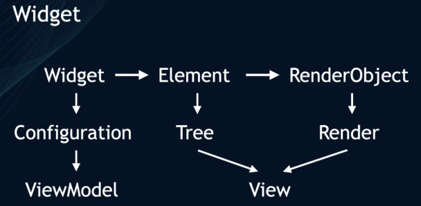

<!-- TOC -->

- [Mixin](#mixin)
- [Stream](#stream)
- [渲染](#%e6%b8%b2%e6%9f%93)

<!-- /TOC -->

## Mixin

**可以理解为「组合」，形如Java接口但更强大；**

**使用方式是通过 class A with B, C, ...，使A得到B、C的方法、字段；**

**除了普通类，可使用关键字 mixin 定义一种特殊的类，专门表示用来mixin(with)的；**

 

**mixin类不能继承或被继承，但是可以（或被）implements；**

**mixin类可以后接 on，例如 mixin A on B ，用以限定 A 只能被 B 及其子类所with；**

**mixin on 所指定的限定类必须包含一个无参无名构造函数；**

## Stream

> **Stream.fromFuture**:从Future创建新的单订阅流,当future完成时将触发一个data或者error，然后使用Down事件关闭这个流。
>
> **Stream.fromFutures**:从一组Future创建一个单订阅流，每个future都有自己的data或者error事件，当整个Futures完成后，流将会关闭。如果Futures为空，流将会立刻关闭。
>
> **Stream.fromIterable**:创建从一个集合中获取其数据的单订阅流。

## 渲染

 

**深度优先** 机制遍历Widget Tree。

 

所有 `Widget` 会组成 `Widget Tree` 。
界面更新时，会更新 `Widget Tree` ，
再更新 `Element Tree` ，最后更新 `RenderObjectTree` 。

布局阶段 => 绘制阶段 => 合成阶段 => 渲染阶段
（`Layout` => `Paint` => `Composite` => `Rasterize`）

 

**布局**

Widget树中的每个孩子节点都会受到父节点所加的位置约束。

（父节点决定孩子节点的位置，孩子节点只能决定自己的大小。）

父亲》孩子》孩子的孩子

 

> 为了防止孩子节点的变化，导致整个 `Widget Tree` 重新布局。
> Flutter加入了 **“布局边界”** 机制（Relayout Boundary）

 

在某些节点，“自动”或“手动”加上 **“布局边界”** ，控制边界。
在该布局边界内的任何节点发生重新布局，都不会影响边界外的 `Widget Tree`的布局。

 

**绘制**

为了解决绘制覆盖问题，Flutter采用了也是和布局阶段相似的策略： **重绘边界** 机制（Repaint Boundary）。
其实，本质上就是加个新的图层，避免在同一图层重绘产生影响。例如： ScrollView

 

**合成**

由于绘制出来的渲染树，会有很多层，同步多层渲染会出现性能问题。
因此，**Flutter会在渲染前，将多个渲染树图层进行合成。**

 

**渲染**

将处理过的“简化版”渲染树，交给`Skia`引擎转换成“二维图像数据”。
 然后 `Skia` 把计算好的图形数据，通过 `OpenGL` 接口交给 `GPU` 渲染 
 顶点着色器 => 形状装配 => 几何着色器 => 光栅化 => 片段着色器 => 测试与混合。

 

 

参考： https://juejin.im/post/5e931cd0e51d4546f5790806

 

