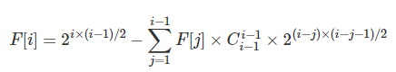

[TOC]

<br/>

<!-- TOC -->

- [整数数组中两两之差绝对值最小的值](#整数数组中两两之差绝对值最小的值)
- [最大连续子序列和问题](#最大连续子序列和问题)
- [硬币找零](#硬币找零)
- [最长公共子序列问题(LCS问题)](#最长公共子序列问题lcs问题)
- [信封嵌套](#信封嵌套)
- [最大正方形](#最大正方形)
- [100盏灯问题](#100盏灯问题)
- [反转链表](#反转链表)
- [无序数中找第k大数](#无序数中找第k大数)
- [只出现一次的数](#只出现一次的数)
- [剪绳子](#剪绳子)
- [无向连通图个数](#无向连通图个数)
- [唯一出现一次的数](#唯一出现一次的数)
- [求1~M之间能被拼成的面值有多少个。](#求1m之间能被拼成的面值有多少个)

<!-- /TOC -->

<br/>

### 整数数组中两两之差绝对值最小的值

将现在的问题进行转化：

设这个整数数组是a1,a2,...,an

构造数组B=(b1,b2,...,bn-1)

b1 = a1-a2,

b2 = a2-a3,

b3 = a3-a4,

...

bn-1 = an-1 - an

那么原数组中，任意两整数之差`ai-aj（1<=i,j<=n）`可以表示成

B中第i个到第j-1个元素的连续求和

例如b2+b3+b4 = (a2-a3) + (a3-a4) + (a4-a5) = a2-a5

O(n)构造出B序列后

用类似“最大子段和”算法求“最小绝对值子段和” 看到这个问题就知道了第二道问题中的方法，求数组b的连续子序列之和的绝对值最小值 这就是两个题目之间的转化

<br/>

### 最大连续子序列和问题

`dp[i]=max{A[i]，dp[i-1]+A[i]}`

<br/>

### 硬币找零

假设有几种硬币，如1、3、5，并且数量无限。请找出能够组成某个数目的找零所使用最少的硬币数。 

用待找零的数值k描述子结构/状态，记作sum[k]，其值为所需的最小硬币数。对于不同的硬币面值coin[0...n]，有`sum[k] = min(sum[k-coin[0]] , sum[k-coin[1]], ...)+1`。对应于给定数目的找零total，需要求解sum[total]的值。

<br/>

### 最长公共子序列问题(LCS问题)

给定两个字符串A和B，长度分别为m和n，要求找出它们最长的公共子序列，并返回其长度。例如： 

A = "HelloWorld" 

B = "loop"

则A与B的最长公共子序列为 "loo",返回的长度为3。

<br/>

```java
/*
dp[i][j]，我们要先判断A的第i个元素B的第j个元素是否相同即判断A[i - 1]和 B[j -1]是否相同，
如果相同它就是dp[i-1][j-1]+ 1，相当于在两个字符串都去掉一个字符时的最长公共子序列再加 1；
否则最长公共子序列取dp[i][j - 1] 和dp[i - 1][j]中大者。
*/
dp[i][0]=0,dp[0][j]=0
//相应的状态转移方程为：
dp[i][j]={max{dp[i−1][j],dp[i][j−1]},dp[i−1][j−1]+1,A[i−1]!=B[j−1]A[i−1]==B[j−1]
```

<br/>

### 信封嵌套

给定一些标记了宽度和高度的信封，宽度和高度以整数对形式 (w, h) 出现。当另一个信封的宽度和高度都比这个信封大的时候，这个信封就可以放进另一个信封里，如同俄罗斯套娃一样。

请计算最多能有多少个信封能组成一组“俄罗斯套娃”信封（即可以把一个信封放到另一个信封里面）。

说明:不允许旋转信封。

**思路**：排序： x 上 递增排序， 如果 x 相同的话，y 上递减排序，最后在 y 上求最大子序列

<br/>

### 最大正方形

 给定一个矩阵，其中的元素为0或者1，要求找出其中元素全为1的面积最大的正方形。

```
思路：最大正方形面积》正方形面积》正方形的边》a[i][j]的边和a[i-1][j-1]、a[i][j-1]、a[i-1][j]的边有何不同》相当于加一操作》得出解题思路
```

<br/>

### 100盏灯问题

问题描述：有100盏灯,编号依次为1,2,3.100,电灯全部关着。现在来了100个人,第一个人把所有的灯开关按下；第二个人隔一个灯按下（2,4,6…）；第三个人每隔两个灯按下（3,6,9…）.第100个人隔99个灯按下（100）,最后还有几盏灯，那几盏灯亮着？

```
思路：最后亮着的灯是被拉动次数为奇数次的；由于只有完全平方数的约数个数为奇数，故本题转换为求100内完全平方数的个数
```

<br/>

### 反转链表

```java
public Node f(Node head) {
    if (head == null || head.next == null) {
         return head;
    } 
    Node pNode = f(head.next);
    head.next.next = head;
    head.next = null;
    return pNode;   
}
```

<br/>

### 无序数中找第k大数 

思路：

1、利用快排思想，直至找到一个排在第k位置的枢轴，因为左边所有数据都比它大，右边都比它小。

2、利用java最小顶堆

<br/>

### 只出现一次的数

思路：异或运算

 <br/>

### 剪绳子

给你一根长度为n的绳子，请把绳子剪成整数长的m段（m、n都是整数，n>1并且m>1），每段绳子的长度记为k[0],k[1],...,k[m]。请问k[0]xk[1]x...xk[m]可能的最大乘积是多少？例如，当绳子的长度是8时，我们把它剪成长度分别为2、3、3的三段，此时得到的最大乘积是18。

思路：除以3取整得到3的个数，取余得到2的个数；

```
 ``* 4 ： 2*2
 ``* 5 ： 2*3
 ``* 6 ： 3*3
 ``* 7 ： 2*2*3  
 ``* 8 ： 2*3*3
 ``* 9 ： 3*3*3
 ``* 10：2*2*3*3  
 ``* 11：2*3*3*3
 ``* 12：3*3*3*3
 ``* 13：2*2*3*3*3 
```


### 无向连通图个数

求 N 个节点的无向连通图有多少个，节点有标号，编号为1~N。

例如下列图示，三个节点的无向连通图共4个。


**输入格式**

输入包含多组测试数据。

每组数据包含一个整数N。

当输入为0时，表示输入终止。

**输出格式**

每组测试数据输出一个结果，每个结果占一行。

**数据范围**

1≤N≤501≤N≤50

**输入样例：**

```
1
2
3
4
0
```

**输出样例：**

```
1
1
4
38
```


无向连通图=所有无向连通图个数-无向不连通的无向图




### 唯一出现一次的数

在一个数组中除了一个数字只出现一次之外，其他数字都出现了三次。

请找出那个只出现一次的数字。

你可以假设满足条件的数字一定存在。

要求只使用 O(n) 的时间和额外 O(1) 的空间。

**样例**

```
输入：[1,1,1,2,2,2,3,4,4,4]

输出：3
```


```c++
    static int find(int[] a) {
        int one = 0, two = 0;
        for (int item : a) {
            one = (one ^ item) & ~two;
            two = (two ^ item) & ~one;
        }
        return one;
    }
```


### 求1~M之间能被拼成的面值有多少个。

给定N种硬币，其中第 i 种硬币的面值为AiAi,共有CiCi个。

从中选出若干个硬币，把面值相加，若结果为S，则称“面值S能被拼成”。

求1~M之间能被拼成的面值有多少个。

**输入格式**

输入包含多组测试用例。

每组测试用例第一行包含两个整数N和M。

第二行包含2N个整数，分别表示A1,A2,…,ANA1,A2,…,AN和C1,C2,…,CNC1,C2,…,CN。

当输入用例N=0，M=0时，表示输入终止，且该用例无需处理。

**输出格式**

每组用例输出一个结果，每个结果占一行。

**数据范围**

1≤N≤1001≤N≤100,
1≤M≤1051≤M≤105,
1≤Ai≤1051≤Ai≤105,
1≤Ci≤10001≤Ci≤1000

**输入用例：**

```
3 10
1 2 4 2 1 1
2 5
1 4 2 1
0 0
```

**输出用例：**

```
8
4
```


