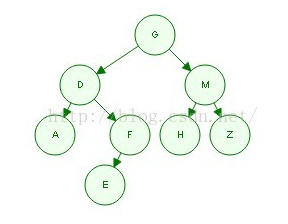

[TOC]

 

<!-- TOC -->

    - [稳定算法与不稳定算法](#稳定算法与不稳定算法)
        - [**常见不稳定排序算法**](#常见不稳定排序算法)
        - [**常见稳定排序算法**](#常见稳定排序算法)
    - [快排](#快排)
    - [二叉树](#二叉树)
    - [平衡二叉树](#平衡二叉树)
    - [红黑树](#红黑树)
- [二叉查找树](#二叉查找树)
- [SimHash算法](#simhash算法)
    - [原理](#原理)
- [TF-IDF 算法](#tf-idf-算法)

<!-- /TOC -->

 

### 稳定算法与不稳定算法

 

#### **常见不稳定排序算法**

1. 1. 选择排序（Selection Sort）— O(n²)
   2. 希尔排序（Shell Sort）— O(nlogn)
   3. 堆排序（Heapsort）— O(nlogn)
   4. 快速排序（Quicksort）— O(nlogn) 期望时间,      O(n²) 最坏情况; 对于大的、乱数串行一般相信是最快的已知排序

 

#### **常见稳定排序算法**

1. 1. 冒泡排序（Bubble Sort） — O(n²)
   2. 插入排序（Insertion Sort）— O(n²)
   3. 桶排序（Bucket Sort）— O(n); 需要 O(k)      额外空间
   4. 计数排序 (Counting Sort) — O(n+k);      需要 O(n+k) 额外空间
   5. 合并排序（Merge Sort）— O(nlogn); 需要      O(n) 额外空间
   6. 二叉排序树排序 （Binary tree sort） —      O(n log n) 期望时间; O(n²)最坏时间; 需要 O(n) 额外空间
   7. 基数排序（Radix sort）— O(n·k); 需要      O(n) 额外空间

 

二分查找时间复杂度：O(logn)   log2(n)

斐波拉契数列： T(n)=T(n-1)+T(n-2)      时间复杂度为  O(2)^n

常见数列的时间复杂度：等差数列：n^2

 

### 快排

 **平均情况下快速排序的时间复杂度是Θ(nlgn)，最坏情况是n2，但通过随机算法可以避免最坏情况。由于递归调用，快排的空间复杂度是Θ(lgn)。**

  

### 二叉树

前序遍历:     GDAFEMHZ  ：局部也是前序

中序遍历:     ADEFGHMZ   ：找到父节点的另一只往上，局部也是中序

后序遍历：   AEFDHZMG   : 局部也是后序

 

一棵深度为 k, 且有 2^k−1 个节点称之为**满二叉树**；

 

### 平衡二叉树

平衡因子

定义：某节点的左子树与右子树的高度(深度)差即为该节点的平衡因子（BF,Balance Factor），平衡二叉树中不存在平衡因子大于 1 的节点。在一棵平衡二叉树中，节点的平衡因子只能取 0 、1 或者 -1 ，分别对应着左右子树等高，左子树比较高，右子树比较高。

  

平衡二叉查找树：简称平衡二叉树。由前苏联的数学家 Adelse-Velskil 和 Landis 在 1962 年提出的高度平衡的二叉树，根据科学家的英文名也称为 AVL 树。它具有如下几个性质：

1. 可以是空树。
2. 假如不是空树，任何一个结点的左子树与右子树都是平衡二叉树，并且高度之差的绝对值不超过1。

 

### 红黑树

（1）每个节点或者是黑色，或者是红色。

（2）根节点是黑色。

（3）每个叶子节点（NIL）是黑色。 [注意：这里叶子节点，是指为空(NIL或NULL)的叶子节点！]

（4）如果一个节点是红色的，则它的子节点必须是黑色的。

（5）从一个节点到该节点的子孙节点的所有路径上包含相同数目的黑节点。

  

红黑树的应用比较广泛，主要是用它来存储有序的数据，它的时间复杂度是O(lgn)，效率非常之高。

例如，**Java集合中的TreeSet和TreeMap**，C++ STL中的set、map，以及**Linux虚拟内存的管理**，都是通过红黑树去实现的。

  

## 二叉查找树

一颗二叉查找树(BST)是一颗二叉树，其中每个节点都含有一个可进行比较的键及相应的值;

且每个节点的键都**大于等于左子树中的任意节点的键**，而**小于右子树中的任意节点的键**。

二叉查找树使用的每个节点含有**两个**链接，它是将链表插入的灵活性和有序数组查找的高效性结合起来的高效符号表实现。

  

节点包含

- 一个键、一个值
- 一条左链接、一条右链接
- 一个节点计数器(以该节点为根的子树的节点总数，包含自身)

  

## SimHash算法

2的64次方字节＝17179869184G=16777216T

2的64次方=1,048,576 T

  

### 原理

将原始的文本映射为64位的二进制数字串，然后通过比较二进制数字串的差异进而来表示原始文本内容的差异。

https://www.cnblogs.com/maybe2030/p/5203186.html#_label0

  

## TF-IDF 算法

把查询关键字和文档都表达成向量，然后利用向量之间的运算来进一步表达向量间的关系。

  

