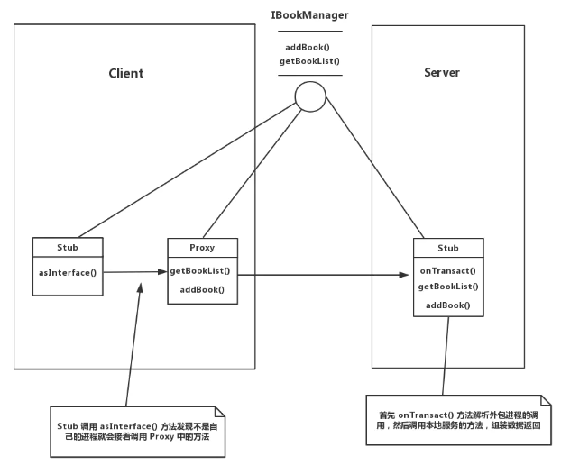

**1、in表示输入型参数：只能由客户端流向服务端，服务端收到该参数对象的完整数据，但服务端对该对象的后续修改不会影响到客户端传入的参数对象；**

**2、out表示输出型参数：只能由服务端流向客户端，服务端收到该参数的空对象，服务端对该对象的后续修改将同步改动到客户端的相应参数对象；**

**3、inout表示输入输出型参数：可在客户端与服务端双向流动，服务端接收到该参数对象的完整数据，且服务端对该对象的后续修改将同步改动到客户端的相应参数对象；**


定向tag需要一定的开销，根据实际需要去确定选择什么tag，不能滥用。


```java
bindService(new Intent(this, DataManagerService.class), dataServiceConnection,
            Context.BIND_AUTO_CREATE);
```





## Service配置

 Service是一种不提供用户交互页面但是可以在后台长时间运行的组件，可以通过在AndroidManifest.xml设置Service的`android:process=":remote"`属性，让Service运行另一个进程中，也就是说，虽然你是在当前应用启动的这个Service，但是这个Service和这个应用并不是同一个进程。


**四大组件都支持`android:process=":remote"`这个属性。**


## 实践总结

包名路径配置

客户端、服务端：aidl文件包名和java文件的包名一致

即：客户端aidl文件包名路径=服务端aidl文件包名路径=客户端java文件包名路径=服务端java文件包名路径；

在客户端设置服务端包名，包名为service的name，如下代码：包名`com.a.http_module.MyService`可为任意的

服务端的service配置：

```
<service
    android:name=".MyService"
    android:enabled="true"
    android:exported="true">
    <intent-filter android:priority="1000">
        <action android:name="com.a.http_module.MyService" />
    </intent-filter>
</service>
```

客户端设置服务端的service的name：

```
Intent intent = new Intent();
//跨进程通信需要使用action启动
intent.setAction("com.a.http_module.MyService");

//android5.0之后，如果servicer不在同一个App的包中，需要设置service所在程序的包名
intent.setPackage("com.a.http_module");
```


### 绑定服务

bindService需要设置包和action；

其中包为service中的name；

action为服务的主页包路径；

```
//设置action为com.vikash.addition
Intent intent = new Intent("com.vikash.addition");
bindService(convertImplicitIntentToExplicitIntent(intent, v.getContext()), connectionService, BIND_AUTO_CREATE);

   public static Intent convertImplicitIntentToExplicitIntent(Intent implicitIntent, Context context) {
        PackageManager pm = context.getPackageManager();
        List<ResolveInfo> resolveInfoList = pm.queryIntentServices(implicitIntent, 0);

        if (resolveInfoList == null || resolveInfoList.size() != 1) {
            return null;
        }
        ResolveInfo serviceInfo = resolveInfoList.get(0);
        //packName1: com.example.aidlserver
        //packName2: com.example.aidlserver.MyService
        Log.d("packName1",serviceInfo.serviceInfo.packageName);
        Log.d("packName2",serviceInfo.serviceInfo.name);
        ComponentName component = new ComponentName(serviceInfo.serviceInfo.packageName, serviceInfo.serviceInfo.name);
        Intent explicitIntent = new Intent(implicitIntent);
        explicitIntent.setComponent(component);
        return explicitIntent;
    }
```

```
Intent intent = new Intent();
//跨进程通信需要使用action启动
intent.setAction("com.a.http_module.MyService");

//android5.0之后，如果servicer不在同一个App的包中，需要设置service所在程序的包名
intent.setPackage("com.a.http_module");
//开启Service
bindService(intent, mConnection, BIND_AUTO_CREATE);
```


intent.setComponent()方法
前名一个参数是应用程序的包名,后一个是这个应用程序的主Activity名


### 流程

在自定义service的onBind中返回内部类接口的实例的Stub对象；内部类中重写接口中定义的方法，为服务的处理；

```
@Override
public IBinder onBind(Intent intent) {
    return myAIDLImplementation;
}
```

在客户端定义：接口实例和服务的连接（ServiceConnection connectionService;）

在连接中获取到接口实例；之后再进行绑定服务即可；

```
connectionService = new ServiceConnection() {
    @Override
    public void onServiceConnected(ComponentName name, IBinder service) {
        mAddition = IAddition.Stub.asInterface(service); //获取接口实例
    }

    @Override
    public void onServiceDisconnected(ComponentName name) {
       // Log.d(this.getClass().getSimpleName(), "Service DisConnected !!");
    }
};
```


