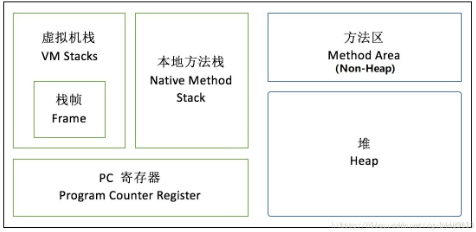

### Java异常
>- 都继承自类Throwable，Throwable子类有Error和Exception，其中Exception又分为运行时异常和编译时异常。编译时异常是未雨绸缪性质的异常，是防范，需要显示处理。运行时异常是程序员问题造成，并不强制进行显示处理。**运行异常和error一样不需要处理，非运行异常需要捕获；**

### final
>- final变量
final 变量能被显式地初始化并且只能初始化一次。被声明为 final 的对象的引用不能指向不同的对象。但是 final 对象里的数据可以被改变。也就是说 **final 对象的引用不能改变，但是里面的值可以改变。**
final 修饰符通常和 static 修饰符一起使用来创建类常量。
>- final 方法
类中的 final 方法可以被子类继承，但是不能被子类修改。声明 final 方法的主要目的是防止该方法的内容被修改。
>- final 类
final 类不能被继承，没有类能够继承 final 类的任何特性。
---
### 内部类
	1.内部类中不能定义静态成员，内部类可以直接访问外部类中的成员变量，
	3.内部类可以定义在外部类的方法外面，也可以定义在外部类的方法体中
	      3.1.在方法体外面定义的内部类的访问类型可以是public,protecte,默认的，private等4种类型，创建内部类的实例对象时，一定要先创建外部类的实例对象，然后用这个外部类的实例对象去创建内部类的实例对象
	
	      3.2.方法内部定义的内部类前面不能有访问类型修饰符，就好像方法中定义的局部变量一样，但这种内部类的前面可以使用final或abstract修饰符。这种内部类对其他类是不可见的，其他类无法引用这种内部类，但是这种内部类创建的实例对象可以传递给其他类访问。
	
	4.在方法外部定义的内部类前面可以加上static关键字，从而成为Static Nested Class，它不再具有内部类的特性，所有，从狭义上讲，它不是内部类

###example
   ```java
   public class Test {
	    private synchronized void a() {
	    }
	    private void b() {
	        synchronized (this) {
	        }
	    }
	    private synchronized static void c() {
	    }
	    private void d() {
	        synchronized (Test.class) {
	        }
	    }
	}
  ```
- 同一个对象，分别调用方法a和b，锁住的是同一个对象
- 同一个对象，分别调用方法b和c，锁住的不是同一个对象
- 同一个对象，分别调用方法a、b、c，锁住的不是同一个对象

###JAVA的初始化顺序：
>- 父类的静态成员初始化>父类的静态代码块>子类的静态成员初始化>子类的静态代码块>父类的代码块>父类的构造方法>子类的代码块>子类的构造方法
>- 静态成员和静态代码块只有在类加载的时候执行一次，再次创建实例时，不再执行，因为只在方法区存在一份，属于一整个类。


