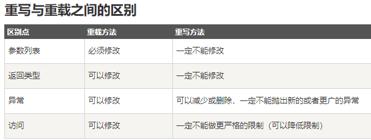

<!-- TOC -->

- [java异常](#java%e5%bc%82%e5%b8%b8)
- [虚拟机模型](#%e8%99%9a%e6%8b%9f%e6%9c%ba%e6%a8%a1%e5%9e%8b)
- [final](#final)
- [内部类](#%e5%86%85%e9%83%a8%e7%b1%bb)
- [重写和重载](#%e9%87%8d%e5%86%99%e5%92%8c%e9%87%8d%e8%bd%bd)
- [Collection 和 Collections的区别](#collection-%e5%92%8c-collections%e7%9a%84%e5%8c%ba%e5%88%ab)
- [JAVA的初始化顺序](#java%e7%9a%84%e5%88%9d%e5%a7%8b%e5%8c%96%e9%a1%ba%e5%ba%8f)
- [线程安全](#%e7%ba%bf%e7%a8%8b%e5%ae%89%e5%85%a8)
- [ArrayList与Vector:](#arraylist%e4%b8%8evector)
- [HashMap与HashTable：](#hashmap%e4%b8%8ehashtable)
- [Servlet](#servlet)
- [super和this](#super%e5%92%8cthis)
- [super(参数)](#super%e5%8f%82%e6%95%b0)
- [构造方法](#%e6%9e%84%e9%80%a0%e6%96%b9%e6%b3%95)
- [复制](#%e5%a4%8d%e5%88%b6)
- [jdk版本](#jdk%e7%89%88%e6%9c%ac)
- [锁](#%e9%94%81)
- [final、finally、finalize 区别](#finalfinallyfinalize-%e5%8c%ba%e5%88%ab)
- [try、catch、finally](#trycatchfinally)
- [ThreadLocal](#threadlocal)
- [堆溢出和栈溢出](#%e5%a0%86%e6%ba%a2%e5%87%ba%e5%92%8c%e6%a0%88%e6%ba%a2%e5%87%ba)
- [getPriority](#getpriority)
- [daemon线程](#daemon%e7%ba%bf%e7%a8%8b)
- [LinkedBlockingQueue](#linkedblockingqueue)
- [复制回收算法](#%e5%a4%8d%e5%88%b6%e5%9b%9e%e6%94%b6%e7%ae%97%e6%b3%95)
- [释放锁资源](#%e9%87%8a%e6%94%be%e9%94%81%e8%b5%84%e6%ba%90)
- [字符集编码](#%e5%ad%97%e7%ac%a6%e9%9b%86%e7%bc%96%e7%a0%81)
- [导包](#%e5%af%bc%e5%8c%85)
- [访问修饰符](#%e8%ae%bf%e9%97%ae%e4%bf%ae%e9%a5%b0%e7%ac%a6)
- [多态](#%e5%a4%9a%e6%80%81)
- [创建派生类对象](#%e5%88%9b%e5%bb%ba%e6%b4%be%e7%94%9f%e7%b1%bb%e5%af%b9%e8%b1%a1)
- [other](#other)
- [堆和栈有什么区别](#%e5%a0%86%e5%92%8c%e6%a0%88%e6%9c%89%e4%bb%80%e4%b9%88%e5%8c%ba%e5%88%ab)
- [synchronized与volatile区别](#synchronized%e4%b8%8evolatile%e5%8c%ba%e5%88%ab)
- [抽象类与接口](#%e6%8a%bd%e8%b1%a1%e7%b1%bb%e4%b8%8e%e6%8e%a5%e5%8f%a3)
- [内存空间指向](#%e5%86%85%e5%ad%98%e7%a9%ba%e9%97%b4%e6%8c%87%e5%90%91)
- [java集合](#java%e9%9b%86%e5%90%88)
- [封装、继承、多态](#%e5%b0%81%e8%a3%85%e7%bb%a7%e6%89%bf%e5%a4%9a%e6%80%81)
- [同步](#%e5%90%8c%e6%ad%a5)
- [哈希冲突](#%e5%93%88%e5%b8%8c%e5%86%b2%e7%aa%81)
- [泛型类型](#%e6%b3%9b%e5%9e%8b%e7%b1%bb%e5%9e%8b)
- [ConcurrentHashMap](#concurrenthashmap)
- [volatile关键字](#volatile%e5%85%b3%e9%94%ae%e5%ad%97)

<!-- /TOC -->


### java异常

Java异常都继承自类Throwable，Throwable子类有Error和Exception，其中Exception又分为运行时异常和编译时异常。编译时异常是未雨绸缪性质的异常，是防范，需要显示处理。运行时异常是程序员问题造成，并不强制进行显示处理。**运行异常和error一样不需要处理**，非运行异常需要捕获；

例题：

- 下列哪种异常是检查型异常，需要在编写程序时声明？ FileNotFoundException

### 虚拟机模型


**栈区:**

每个线程包含一个栈区，栈中只保存方法中（不包括对象的成员变量）的基础数据类型和自定义对象的引用(不是对象)，对象都存放在堆区中

每个栈中的数据(原始类型和对象引用)都是私有的，其他栈不能访问。

栈分为3个部分：基本类型变量区、执行环境上下文、操作指令区(存放操作指令)。

**堆区:**

存储的全部是对象实例，每个对象都包含一个与之对应的class的信息(class信息存放在方法区)。

jvm只有一个堆区(heap)被所有线程共享，堆中不存放基本类型和对象引用，只存放对象本身，几乎所有的对象实例和数组都在堆中分配。

**方法区:**

又叫静态区，跟堆一样，被所有的线程共享。它用于存储已经被虚拟机加载的类信息、常量、静态变量、即时编译器编译后的代码等数据。


------


### final

**final 变量：**

final 变量能被显式地初始化并且只能初始化一次。被声明为 final 的对象的引用不能指向不同的对象。但是 final 对象里的数据可以被改变。也就是说 **final 对象的引用不能改变，但是里面的值可以改变。**

final 修饰符通常和 static 修饰符一起使用来创建类常量。

**final 方法**

类中的 final 方法可以被子类继承，但是不能被子类修改。

声明 final 方法的主要目的是防止该方法的内容被修改。

如下所示，使用 final 修饰符声明方法。

**final 类**

final 类不能被继承，没有类能够继承 final 类的任何特性。


### 内部类

1.内部类中不能定义静态成员，内部类可以直接访问外部类中的成员变量，

2.内部类可以定义在外部类的方法外面，也可以定义在外部类的方法体中

   2.1.在方法体外面定义的内部类的访问类型可以是public,protecte,默认的，private等4种类型，创建内部类的实例对象时，一定要先创建外部类的实例对象，然后用这个外部类的实例对象去创建内部类的实例对象

   2.2.方法内部定义的内部类前面不能有访问类型修饰符，就好像方法中定义的局部变量一样，但这种内部类的前面可以使用final或abstract修饰符。这种内部类对其他类是不可见的，其他类无法引用这种内部类，但是这种内部类创建的实例对象可以传递给其他类访问。

3.在方法外部定义的内部类前面可以加上static关键字，从而成为Static Nested Class，它不再具有内部类的特性，所有，从狭义上讲，它不是内部类


匿名的内部类是没有名字的内部类。不能extends(继承) 其它类，但一个内部类可以作为一个接口，由另一个内部类实现

**静态内部类（Inner Class）意味着**

**1创建一个static内部类的对象，不需要一个外部类对象**

**2不能从一个static内部类的一个对象访问一个外部类对象**


### 重写和重载



**重写Overriding是父类与子类之间多态性的一种表现，重载Overloading是一个类中多态性的一种表现。**


### Collection 和 Collections的区别

答： Collection是集合类的上级接口，继承与他的接口主要有Set 和List.Collections是针对集合类的一个帮助类，他提供一系列静态方法实现对各种集合的搜索、排序、线程安全化等操作


### JAVA的初始化顺序

- 父类的静态成员初始化>父类的静态代码块>子类的静态成员初始化>子类的静态代码块>父类的代码块>父类的构造方法>子类的代码块>子类的构造方法
- 静态成员和静态代码块只有在类加载的时候执行一次，再次创建实例时，不再执行，因为只在方法区存在一份，属于一整个类。


### 线程安全

hashtable、concurrentHashMap、synchronizedMap、vector、LinkBlockingQueue、枚举、StringBuffer、stack


在接口中：abstract只能修饰类和方法，不能修饰字段**

一个Java源程序文件中定义几个类和接口，则编译该文件后生成几个以.class为后缀的字节码文件。

jre 判断程序是否执行结束的标准是（）  所有的前台线程执行完毕


### ArrayList与Vector:

一.同步性:**Vector是线程安全的**，也就是说是同步的，而**ArrayList是线程序不安全的，不是同步的** 

二.数据增长:当需要增长时,Vector默认增长为原来一培，而ArrayList却是原来的一半

 

### HashMap与HashTable：

一.历史原因:Hashtable是基于陈旧的Dictionary类的，HashMap是Java 1.2引进的Map接口的一个实现

二.同步性:Hashtable是线程安全的，也就是说是同步的，而**HashMap是线程序不安全的，不是同步**的三.值：只有HashMap可以让你将空值作为一个表的条目的key或value


### Servlet

Servlet的生命周期属于初始化阶段是（）。

1. 加载Servlet类及.class对应的数据
2. 创建ServletConfig对象
3. 创建Servlet对象


### super和this

**super和this都只能位于构造器的第一行，而且不能同时使用，这是因为会造成初始化两次，this用于调用重载的构造器，super用于调用父类被子类重写的方法**


### super(参数)

在调用子类构造器之前，会先调用父类构造器，当子类构造器中没有使用"super(参数或无参数)"指定调用父类构造器时，是默认调用父类的无参构造器，如果父类中包含有参构造器，却没有无参构造器，则在子类构造器中一定要使用“super(参数)”指定调用父类的有参构造器，不然就会报错。


### 构造方法

下面的对象创建方法中哪些会调用构造方法 （）？

new语句创建对象

java反射机制使用java.lang.Class或java.lang.reflect.Constructor的newInstance()方法

**子类不可以继承父类的构造方法，只可以调用父类的构造方法。**

构造器Constructor不能被继承，因此不能重写Overriding，但可以被重载Overloading


### 复制

java语言的下面几种数组复制方法中，哪个效率最高？  **System.arraycopy**

 复制的效率：System.arraycopy>clone>Arrays.copyOf>for循环


### jdk版本

截止JDK1.8版本,java并发框架支持锁包括?

读写锁、自旋锁、乐观锁


### 锁

读写锁实际是一种特殊的自旋锁，它把对共享资源的访问者划分成读者和写者，读者只对共享资源进行读访问，写者则需要对共享资源进行写操作。

**悲观锁**

总是假设最坏的情况，**每次去拿数据的时候都认为别人会修改**，所以每次在拿数据的时候都会上锁，这样别人想拿这个数据就会阻塞直到它拿到锁（共享资源每次只给一个线程使用，其它线程阻塞，用完后再把资源转让给其它线程）。

**乐观锁**

总是假设最好的情况，每次去拿数据的时候都认为别人不会修改，所以不会上锁，但是在更新的时候会判断一下在此期间别人有没有去更新这个数据，可以使用版本号机制和CAS算法实现。**乐观锁适用于多读的应用类型，这样可以提高吞吐量，**像数据库提供的类似于write_condition机制，其实都是提供的乐观锁。

 **活锁**指的是任务或者执行者没有被阻塞，由于某些条件没有满足，**导致一直重复尝试—失败—尝试—失败的过程。处于活锁的实体是在不断的改变状态，活锁有可能自行解开。**


### final、finally、finalize 区别

**final修饰变量，变量的引用（也就是指向的地址）不可变，但是引用的内容可以变（地址中的内容可变）。**

**finally表示总是执行。但是其实finally也有不执行的时候。在try中调用System.exit(0)，强制退出了程序，finally块不执行。**

**finalize方法，这个方法一个对象只能执行一次，只能在第一次进入被回收的队列，而且对象所属于的类重写了finalize方法才会被执行。第二次进入回收队列的时候，不会再执行其finalize方法，而是直接被二次标记，在下一次GC的时候被GC。**


### try、catch、finally

**finally一定会在return之前执行，但是如果finally使用了return或者throw语句，将会使trycatch中的return或者throw失效**

try的形式有三种：

try-catch

try-finally

try-catch-finally

但catch和finally语句不能同时省略！


### ThreadLocal

1. ThreadLocal存放的值是线程封闭，线程间互斥的，主要用于线程内共享一些数据，避免通过参数来传递
2. 线程的角度看，每个线程都保持一个对其线程局部变量副本的隐式引用，只要线程是活动的并且     ThreadLocal 实例是可访问的；在线程消失之后，其线程局部实例的所有副本都会被垃圾回收
3. 在Thread类中有一个Map，用于存储每一个线程的变量的副本。
4. 对于多线程资源共享的问题，同步机制采用了“以时间换空间”的方式，而ThreadLocal采用了“以空间换时间”的方式

例题：

对于线程局部存储TLS(thread local     storage)，以下表述正确的是

解决多线程中的对同一变量的访问冲突的一种技术

TLS会为每一个线程维护一个和该线程绑定的变量的副本

Java平台的java.lang.ThreadLocal是TLS技术的一种实现

------

### 堆溢出和栈溢出

JVM运行时内存 = 共享内存区 + 线程内存区

堆溢出

内存泄漏、内存溢出：均会抛出 OutOfMemoryError:java 

栈（JVM Stack）存放主要是栈帧( 局部变量表, 操作数栈 , 动态链接 , 方法出口信息 )的地方。

注意区分栈和栈帧：栈里包含栈帧。

与线程栈相关的内存异常有两个：

a）、StackOverflowError(方法调用层次太深，内存不够新建栈帧)

b）、OutOfMemoryError（线程太多，内存不够新建线程）


### getPriority

getPriority()是获取线程优先级的方法，在线程中没有exit()方法，一般使用return 结束，或者ExitThread函数


### daemon线程

将一个线程标记成daemon线程，意味着当主线程结束，并且没有其它正在运行的非daemon线程时，该daemon线程也会自动结束。

Java的Daemon线程，setDaemon(     )设置必须要？ 在start之前


### LinkedBlockingQueue

LinkedBlockingQueue是一个可选有界队列，不允许null值

PriorityQueue是一个无界队列，不允许null值，入队和出队的时间复杂度是O（log(n)）


### 复制回收算法

以下哪些jvm的垃圾回收方式采用的是复制算法回收？

新生代串行收集器

新生代并行回收收集器


### 释放锁资源

下列哪些操作会使线程释放锁资源？

wait()

join()


### 字符集编码

java 语言使用的字符码集是  Unicode


### 导包

在运行时，由java解释器自动引入，而不用import语句引入的包是()。  java.lang


### 访问修饰符


### 多态

在java的多态调用中，new的是哪一个类就是调用的哪个类的方法。**（错）**

子类继承父类，但是没有实现其中的方法，当进行向上转型赋值时，调用的方法就只是父类的


### 创建派生类对象

在创建派生类对象，构造函数的执行顺序（）

基类构造函数，派生类对象成员构造函数，派生类本身的构造函数


### other

KMP算法的时间复杂度是O(n)

最大流问题和最小割问题是等价的

PageRank算法总是会收敛

最长路径问题是NP问题，还没证实存在多项式时间复杂度。


String s = new  String("xyz");创建了几个String Object

答： 两个，一个字符对象，一个字符对象引用对象


Math.round(11.5)==12;Math.round(-11.5)==-11;


short s1 = 1; s1 = s1 + 1;有什么错?     short s1 = 1; s1 += 1;有什么错

答： short s1 = 1; s1 = s1 + 1; （s1+1运算结果是int型，需要强制转换类型）short s1 = 1; s1 += 1;（可以正确编译）


用最有效率的方法算出2乘以8等于几

答： 2 << 3


char型变量中能不能存贮一个中文汉字?为什么?

答： 是能够定义成为一个中文的，因为java中以unicode编码，一个char占2个字节，所以放一个中文是没问题的


### 堆和栈有什么区别

**栈是一种线形集合，其添加和删除元素的操作应在同一段完成。**栈按照后进先出的方式进行处理。**堆是栈的一个组成元素**

全局堆就是所有没有分配的空间，局部堆就是用户分配的空间。

栈是线程独有的，保存其运行状态和局部自动变量的。

栈的优势是，栈内存与堆内存相比是非常小的，存取速度比堆要快，仅次于寄存器，栈数据可以共享。但缺点是，存在栈中的数据大小与生存期必须是确定的，缺乏灵活性。栈中主要存放一些基本类型的变量（int, short, long, byte, float, double, boolean, char）和对象句柄。栈有一个很重要的特殊性，就是存在栈中的数据可以共享。


### synchronized与volatile区别

synchronized保证三大性，原子性，有序性，可见性，volatile保证有序性，可见性，不能保证原子性


### 抽象类与接口

抽象类

特点:

1.抽象类中可以构造方法

2.抽象类中可以存在普通属性，方法，静态属性和方法。

3.抽象类中可以存在抽象方法。

4.如果一个类中有一个抽象方法，那么当前类一定是抽象类；抽象类中不一定有抽象方法。

5.抽象类中的抽象方法，需要有子类实现，如果子类不实现，则子类也需要定义为抽象的。

接口

1.在接口中只有方法的声明，没有方法体。

2.在接口中只有常量，因为定义的变量，在编译的时候都会默认加上public static final 

3.在接口中的方法，永远都被public来修饰。

4.接口中没有构造方法，也不能实例化接口的对象。

5.接口可以实现多继承

6.接口中定义的方法都需要有实现类来实现，如果实现类不能实现接口中的所有方法

7.则实现类定义为抽象类。

```java
接口可以有default、static方法 
interface A {
    abstract void a();
    static void s() {
    }
    default void d(){
       
    }
    void b();//默认用abstract修饰
    int a = 0;//默认用static final 修饰
}
```

```java
下面选项中,哪些是interface中合法方法定义?()

public void main(String [] args);

boolean setFlag(Boolean [] test);

public float get(int x);
```


### 内存空间指向

对于一个对象来说，只要有强引用的存在，它就会一直存在于内存中

不考虑反射，String类型变量所指向内存空间中的内容是不能被改变的 。


### java集合


### 封装、继承、多态

**封装**

封装最好理解了。封装是面向对象的特征之一，是对象和类概念的主要特性。**封装，也就是把客观事物封装成抽象的类，并且类可以把自己的数据和方法只让可信的类或者对象操作，对不可信的进行信息隐藏。**

**继承**

继承是指这样一种能力：它可以使用现有类的所有功能，并在无需重新编写原来的类的情况下对这些功能进行扩展。通过继承创建的新类称为“子类”或“派生类”，被继承的类称为“基类”、“父类”或“超类”。

要实现继承，可以通过“继承”（Inheritance）和“组合”（Composition）来实现。

**多态性**

多态性（polymorphisn）是允许你将父对象设置成为和一个或更多的他的子对象相等的技术，赋值之后，父对象就可以根据当前赋值给它的子对象的特性以不同的方式运作。简单的说，就是一句话：允许将子类类型的指针赋值给父类类型的指针。

实现多态，有两种方式，覆盖和重载。覆盖和重载的区别在于，覆盖在运行时决定，重载是在编译时决定。并且覆盖和重载的机制不同，例如在 Java 中，重载方法的签名必须不同于原先方法的，但对于覆盖签名必须相同。


### 同步

实现同步的几种方式：

（1）Synchronized关键字：Java语言中，每个对象都有一个对象锁与之对应，这个锁表明，任何时候只允许被一个线程拥有，**当一个线程调用对象的一段Synchronized代码时，需要先获取这个锁，然后执行这段代码，执行结束后，释放锁。**

上面的方法，synchronized修饰在了方法上面，**如果修饰静态方法，此时如果调用该静态方法，将会锁住整个类。**

**synchronized还可以修饰语句块，称之为同步代码块。被该关键字修饰的语句块会自动被加上内置锁，从而实现同步**

 

**注意：**

**同步是一种高开销的操作，因此应该尽量减少同步的内容。通常没有必要同步整个方法，使用synchronized代码块同步关键代码即可。**

 

**（2）使用Volatile关键字实现线程同步**

**① 内存可见性，即线程A对volatile变量的修改，其他线程获取的volatile变量都是最新的。**

**② 可以禁止指令重排序**

**每次要线程要访问volatile修饰的变量时都是从内存中读取，而不是存缓存当中读取，因此每个线程访问到的变量值都是一样的。这样就保证了同步。**

 

**（3）使用重入锁实现线程同步**

**ReentrantLock类是可重入、互斥、实现了Lock接口的锁， 它与使用synchronized方法具有相同的基本行为和语义，并且扩展了其能力。**

**ReenreantLock类的常用方法有：**

  **ReentrantLock() : 创建一个ReentrantLock实例**

  **lock() : 获得锁**

  **unlock() : 释放锁**

**如果synchronized关键字能满足用户的需求，就用synchronized，因为它能简化代码 。如果需要更高级的功能，就用ReentrantLock类，此时要注意及时释放锁，否则会出现死锁，通常在finally代码释放锁**

 

**（4）使用局部变量实现线程同步**

**使用ThreadLocal管理变量，则每一个使用该变量的线程都获得该变量的副本， 副本之间相互独立，这样每一个线程都可以随意修改自己的变量副本，而不会对其他线程产生影响。**

 

**（5）使用阻塞队列实现线程同步**

**LinkedBlockingQueue是一个先进先出的顺序（FIFO）的阻塞队列**

**LinkedBlockingQueue 类常用方法：**

**//LinkedBlockingQueue() : 创建一个容量为Integer.MAX_VALUE的LinkedBlockingQueue** 

**//put(E e) : 在队尾添加一个元素，如果队列满则阻塞** 

**//size() : 返回队列中的元素个数** 

**//take() : 移除并返回队头元素，如果队列空则阻塞** 

 

**（6）使用原子变量实现线程同步**

**需要使用线程同步的根本原因在于对普通变量的操作不是原子的。**

 

 **(7）wait(）方法与notify() 方法**


**hashmap**原理：

hashmap是数组加链表组合而成的。hashcode除以链表长度取余数，余数为索引号，链表长度达到8时，链表采用**拉链法，**使用红黑树算法。

hash索引确定，当一个新的价值对添加时，通过hash（key）%数组长度得到数据的索引号，根据索引号进行插入，**数组中存放的总是最新插入的节点**

jdk1.7和jdk1.8有些区别，jdk1.8的性能更好


### 哈希冲突

开放定址法

开放定址法就是一旦发生了冲突，就去寻找下一个空的散列地址，只要散列表足够大，空的散列地址总能找到，并将记录存入。

链地址法

将哈希表的每个单元作为链表的头结点，所有哈希地址为i的元素构成一个同义词链表。即发生冲突时就把该关键字链在以该单元为头结点的链表的尾部。

再哈希法

当哈希地址发生冲突用其他的函数计算另一个哈希函数地址，直到冲突不再产生为止。

建立公共溢出区

将哈希表分为基本表和溢出表两部分，发生冲突的元素都放入溢出表中。


### 泛型类型 

```java
<?>  等价于<? extends Object >   非受限

<? extends T>  受限，本类和子类,上界通配符

<? super T>  本类和父类，下界通配符

泛型的好处：在编译时检测错误，而不是运行时；提高代码可读性
```


### ConcurrentHashMap

ConcurrentHashMap所使用的锁分段技术，首先将数据分成一段一段的存储，然后给每一段数据配一把锁，当一个线程占用锁访问其中一个段数据的时候，其他段的数据也能被其他线程访问。


### volatile关键字

其实volatile关键字的作用就是保证了可见性和有序性（不保证原子性）。

如果一个共享变量被volatile关键字修饰，那么如果一个线程修改了这个共享变量后，其他线程是立马可知的。 

比如，线程A修改了自己的共享变量副本，这时如果该共享变量没有被volatile修饰，那么本次修改不一定会马上将修改结果刷新到主存中，如果此时B去主存中读取共享变量的值，那么这个值就是没有被A修改之前的值。如果该共享变量被volatile修饰了，那么本次修改结果会强制立刻刷新到主存中，如果此时B去主存中读取共享变量的值，那么这个值就是被A修改之后的值了。 

volatile能禁止指令重新排序，在指令重排序优化时，在volatile变量之前的指令不能在volatile之后执行，在volatile之后的指令也不能在volatile之前执行，所以它保证了有序性。


**volatile和synchronized的作用和区别是什么？** 

（1）volatile只能作用于变量，使用范围较小。synchronized可以用在方法、类、同步代码块等，使用范围比较广。 （java里不能直接使用synchronized声明一个变量，而是使用synchronized去修饰一个代码块或一个方法或类。）

（2）volatile只能保证可见性和有序性，不能保证原子性。而可见性、有序性、原子性synchronized都可以保证。 

（3）volatile不会造成线程阻塞。synchronized可能会造成线程阻塞。

**举例：**

```java
double pi = 3.14;  //A

double r = 1;    //B

double s= pi * r * r;//C
```

上面的语句，可以按照`A->B->C`执行，结果为3.14,但是也可以按照`B->A->C`的顺序执行，因为A、B是两句独立的语句，而C则依赖于A、B，所以A、B可以重排序，但是C却不能排到A、B的前面。JMM保证了重排序不会影响到单线程的执行，但是在多线程中却容易出问题。


