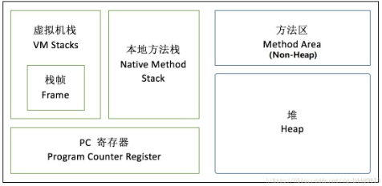
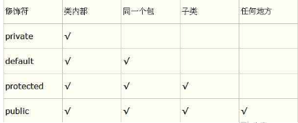

### java异常

Java异常都继承自类Throwable，Throwable子类有Error和Exception，其中Exception又分为运行时异常和编译时异常。编译时异常是未雨绸缪性质的异常，是防范，需要显示处理。运行时异常是程序员问题造成，并不强制进行显示处理。**运行异常和error一样不需要处理**，非运行异常需要捕获；

例题：

- 下列哪种异常是检查型异常，需要在编写程序时声明？ FileNotFoundException

### 虚拟机模型

### final

**final 变量：**

final 变量能被显式地初始化并且只能初始化一次。被声明为 final 的对象的引用不能指向不同的对象。但是 final 对象里的数据可以被改变。也就是说 **final 对象的引用不能改变，但是里面的值可以改变。**

final 修饰符通常和 static 修饰符一起使用来创建类常量。

**final 方法**

类中的 final 方法可以被子类继承，但是不能被子类修改。

声明 final 方法的主要目的是防止该方法的内容被修改。

如下所示，使用 final 修饰符声明方法。

**final 类**

final 类不能被继承，没有类能够继承 final 类的任何特性。

### 内部类

1.内部类中不能定义静态成员，内部类可以直接访问外部类中的成员变量，

2.内部类可以定义在外部类的方法外面，也可以定义在外部类的方法体中

   2.1.在方法体外面定义的内部类的访问类型可以是public,protecte,默认的，private等4种类型，创建内部类的实例对象时，一定要先创建外部类的实例对象，然后用这个外部类的实例对象去创建内部类的实例对象

   2.2.方法内部定义的内部类前面不能有访问类型修饰符，就好像方法中定义的局部变量一样，但这种内部类的前面可以使用final或abstract修饰符。这种内部类对其他类是不可见的，其他类无法引用这种内部类，但是这种内部类创建的实例对象可以传递给其他类访问。

3.在方法外部定义的内部类前面可以加上static关键字，从而成为Static Nested Class，它不再具有内部类的特性，所有，从狭义上讲，它不是内部类

### JAVA的初始化顺序

- 父类的静态成员初始化>父类的静态代码块>子类的静态成员初始化>子类的静态代码块>父类的代码块>父类的构造方法>子类的代码块>子类的构造方法
- 静态成员和静态代码块只有在类加载的时候执行一次，再次创建实例时，不再执行，因为只在方法区存在一份，属于一整个类。

### 线程安全

hashtable、concurrentHashMap、synchronizedMap、vector、LinkBlockingQueue、枚举

**在接口中：abstract只能修饰类和方法，不能修饰字段**

一个Java源程序文件中定义几个类和接口，则编译该文件后生成几个以.class为后缀的字节码文件。

jre 判断程序是否执行结束的标准是（）  所有的前台线程执行完毕

### Servlet

Servlet的生命周期属于初始化阶段是（）。

1. 加载Servlet类及.class对应的数据
2. 创建ServletConfig对象
3. 创建Servlet对象

### interface

下面选项中,哪些是interface中合法方法定义?()

public void main(String [] args);

boolean setFlag(Boolean [] test);

public float get(int x);

### super和this

**super和this都只能位于构造器的第一行，而且不能同时使用，这是因为会造成初始化两次，this用于调用重载的构造器，super用于调用父类被子类重写的方法**

### 复制

java语言的下面几种数组复制方法中，哪个效率最高？  **System.arraycopy**

 复制的效率：System.arraycopy>clone>Arrays.copyOf>for循环

### jdk版本

截止JDK1.8版本,java并发框架支持锁包括?

读写锁、自旋锁、乐观锁

### 锁

读写锁实际是一种特殊的自旋锁，它把对共享资源的访问者划分成读者和写者，读者只对共享资源进行读访问，写者则需要对共享资源进行写操作。

**悲观锁**

总是假设最坏的情况，**每次去拿数据的时候都认为别人会修改**，所以每次在拿数据的时候都会上锁，这样别人想拿这个数据就会阻塞直到它拿到锁（共享资源每次只给一个线程使用，其它线程阻塞，用完后再把资源转让给其它线程）。

**乐观锁**

总是假设最好的情况，每次去拿数据的时候都认为别人不会修改，所以不会上锁，但是在更新的时候会判断一下在此期间别人有没有去更新这个数据，可以使用版本号机制和CAS算法实现。**乐观锁适用于多读的应用类型，这样可以提高吞吐量，**像数据库提供的类似于write_condition机制，其实都是提供的乐观锁。

 **活锁**指的是任务或者执行者没有被阻塞，由于某些条件没有满足，**导致一直重复尝试—失败—尝试—失败的过程。处于活锁的实体是在不断的改变状态，活锁有可能自行解开。**

### final、finally、finalize 区别

**final修饰变量，变量的引用（也就是指向的地址）不可变，但是引用的内容可以变（地址中的内容可变）。**

**finally表示总是执行。但是其实finally也有不执行的时候。在try中调用System.exit(0)，强制退出了程序，finally块不执行。**

**finalize方法，这个方法一个对象只能执行一次，只能在第一次进入被回收的队列，而且对象所属于的类重写了finalize方法才会被执行。第二次进入回收队列的时候，不会再执行其finalize方法，而是直接被二次标记，在下一次GC的时候被GC。**

### ThreadLocal

1. ThreadLocal存放的值是线程封闭，线程间互斥的，主要用于线程内共享一些数据，避免通过参数来传递
2. 线程的角度看，每个线程都保持一个对其线程局部变量副本的隐式引用，只要线程是活动的并且     ThreadLocal 实例是可访问的；在线程消失之后，其线程局部实例的所有副本都会被垃圾回收
3. 在Thread类中有一个Map，用于存储每一个线程的变量的副本。
4. 对于多线程资源共享的问题，同步机制采用了“以时间换空间”的方式，而ThreadLocal采用了“以空间换时间”的方式

例题：

对于线程局部存储TLS(thread local     storage)，以下表述正确的是

解决多线程中的对同一变量的访问冲突的一种技术

TLS会为每一个线程维护一个和该线程绑定的变量的副本

Java平台的java.lang.ThreadLocal是TLS技术的一种实现

------

### 堆溢出和栈溢出

JVM运行时内存 = 共享内存区 + 线程内存区

堆溢出

内存泄漏、内存溢出：均会抛出 OutOfMemoryError:java 

栈（JVM Stack）存放主要是栈帧( 局部变量表, 操作数栈 , 动态链接 , 方法出口信息 )的地方。

注意区分栈和栈帧：栈里包含栈帧。

与线程栈相关的内存异常有两个：

a）、StackOverflowError(方法调用层次太深，内存不够新建栈帧)

b）、OutOfMemoryError（线程太多，内存不够新建线程）

### getPriority

getPriority()是获取线程优先级的方法，在线程中没有exit()方法，一般使用return 结束，或者ExitThread函数

### daemon线程

将一个线程标记成daemon线程，意味着当主线程结束，并且没有其它正在运行的非daemon线程时，该daemon线程也会自动结束。

Java的Daemon线程，setDaemon(     )设置必须要？ 在start之前

### LinkedBlockingQueue

LinkedBlockingQueue是一个可选有界队列，不允许null值

PriorityQueue是一个无界队列，不允许null值，入队和出队的时间复杂度是O（log(n)）

### 复制回收算法

以下哪些jvm的垃圾回收方式采用的是复制算法回收？

新生代串行收集器

新生代并行回收收集器

### 释放锁资源

下列哪些操作会使线程释放锁资源？

wait()

join()

### 字符集编码

java 语言使用的字符码集是  Unicode

### 导包

在运行时，由java解释器自动引入，而不用import语句引入的包是()。  java.lang

### 访问修饰符

### 创建派生类对象

在创建派生类对象，构造函数的执行顺序（）

基类构造函数，派生类对象成员构造函数，派生类本身的构造函数

### other

KMP算法的时间复杂度是O(n)

最大流问题和最小割问题是等价的

PageRank算法总是会收敛

最长路径问题是NP问题，还没证实存在多项式时间复杂度。

### 时间复杂度

对于一个含n个元素的无序数组，构建一个大顶堆（Max-Heap），该操作的时间复杂度是Θ(____)

初始化建堆时间复杂度是O(n),排序重建堆时间复杂度则为nlog(n)

例题：

下列各排序法中，最坏情况下的时间复杂度最低的是（ ）

堆排序

堆排序最坏情况时间下的时间复杂度为 O(nlog2n) ；希尔排序最坏情况时间下的时间复杂度为 O(n1.5) ；快速排序、冒泡排序最坏情况时间下的时间复杂度为 O(n2) 。

### 线性结构

- 广义表是非线性结构的，它也是线性表的一种推广
- 二叉树是树状结构
- 稀疏矩阵常用来存储图
- 串，如字符串，是线性结构

### 哈夫曼编码

已知字符A、B、C、D的使用频率（权值）分别为22，7，9，27。对其进行HUFFMAN编码，各字符对应的编码为（ ）

A（11） B（100）C（101） D（0）

