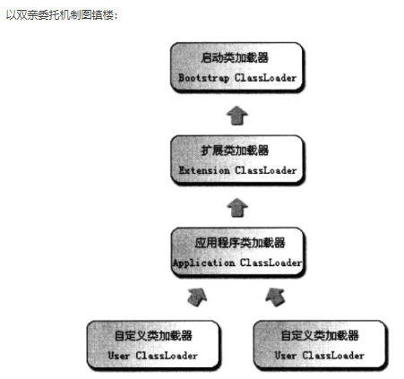

 

<!-- TOC -->

- [编码](#编码)
- [类加载器](#类加载器)
- [HashMap 死循环](#hashmap-死循环)
- [Hash 函数](#hash-函数)
- [常用java数据结构](#常用java数据结构)
- [CAS机制](#cas机制)
- [重入锁](#重入锁)

<!-- /TOC -->

 

### 编码

1. char 、int、long 分别占2、4、8字节
2. 编码方式及区别： http://www.ruanyifeng.com/blog/2007/10/ascii_unicode_and_utf-8.html
3. 比如，简体中文常见的编码方式是     GB2312，使用两个字节表示一个汉字，所以理论上最多可以表示 256 x 256 = 65536 个符号。
4. GBK是GB2312的扩展，是向上兼容的，因此GB2312中的汉字的编码与GBK中汉字的相同。GBK中每个汉字仍然包含两个字节

 

### 类加载器

**用来加载 Java 类到 Java 虚拟机中。类加载器负责读取 Java 字节代码，并转换成 java.lang.Class类的一个实例。**

 

 

引导类加载器：jvm在运行时，内嵌在jvm中的一段特殊的用来**加载java核心类库**的C++代码。

引导类加载器不是java原生代码编写的，所以其也**不是java.lang.ClassLoader类的实例**，**其没有getParent方法。**

拓展类加载器：用来**加载jvm实现的一个拓展目录**，该目录下的所有java类都由此类加载器加载。

应用类加载器：应用类加载器又称为系统类加载器，开发者可用通过 java.lang.ClassLoader.getSystemClassLoader()方法获得此类加载器的实例

**加载程序开发者自己编写的java类。**

应用类加载器是java.lang.ClassLoader类的一个实例，**其getParent方法返回的是拓展类加载器。**

**拓展类加载器和应用类加载器都是java.lang.ClassLoader类的一个实例**

 

类加载器的加载机制

当jvm要加载某个类时，jvm会先指定一个类加载器，负责加载此类。而此指定的类加载器在尝试自己去根据某个类的二进制名字查找其相应的字节码文件并定义之前，会首先委托给其父亲（getParent方法返回的类加载器)尝试加载，如果加载失败，就会由自己来尝试加载此类。一般情况下，这个由jvm指定的类加载器就是应用类加载器，jvm会自动调用其loadClass(String name)方法来开启类的加载过程

 

双亲委托机制的优缺点

可以保证java核心类库的安全，即保证由引导类加载器加载的类不能被用户随便替换，用户不能自己随便定义一个二进制名也为java.lang.String     的类来替换java核心类库的java.lang.String类，否则会抛出ClassCastException。

使得一个类的不同版本可以共存在jvm中，带来了极大的灵活性，OSGi技术的实现就是得益于此。

 

### HashMap 死循环

HashMap 在并发执行 put 操作时会引起死循环，导致 CPU 利用率接近 100%。因为多线程会导致 HashMap 的 Node 链表形成环形数据结构，一旦形成环形数据结构，Node 的 next 节点永远不为空，就会在获取 Node 时产生死循环。

其实死循环并不是发生在put操作时，而是发生在**扩容**时。

 

### Hash 函数

1. 直接定址法：直接以关键字 k 或者 k 加上某个常数作为哈希地址。
2. 数字分析法：提取关键字中比较均匀的数字作为哈希地址。
3. 除留余数法：用关键字 k 除以某个不大于哈希表长度 m 的 数     p ,将所得余数作为哈希表地址。
4. 伪随机数法：采用一个伪随机数当作哈希函数。

 

### 常用java数据结构

ArrayList 底层数组，速度快，增删慢，不安全，扩容当前1.5倍+1；

Vector 安全，底层数组，扩容当前1倍

LinkedList 不安全，底层双向链表；

HashMap key，value可为null；不安全，默认16，每次扩充原来2倍；

HashTable 键不可以重复，值可以重复，底层hash表，默认初始化大小11，每次扩充为原来的2n+1，key和value都不允许为null；

TreeMap 键不可以重复，值可以重复；根据key升序排列，key实现Comparable接口；底层：二叉树，红黑树

ConcurrentHashMap 一旦初始化，不能进行扩容；默认16，理论支撑同时16个线程并发写

 

### CAS机制

产生原因： 多线程并发的时候，如果加锁势必影响吞吐量，不加锁则会影响临界区的临界资源，不安全

CAS是英文单词Compare And Swap的缩写，翻译过来就是比较并替换。

 

原理： 

一个CAS方法包含**三个参数**CAS(V,E,N)。V表示要更新的**变量**，E表示**预期值**，N表示**新值**。

**只有当V的值等于E时，才会将V的值修改为N。**

**如果V的值不等于E，说明已经被其他线程修改了，当前线程可以放弃此操作，也可以再次尝试次操作直至修改成功。**

基于这样的算法，CAS操作即使没有锁，也可以发现其他线程对当前线程的干扰（临界区值的修改），并进行恰当的处理。初次接触CAS的人一般都是通过AtomicInteger这个类来了解

 

**应用场景：**

**跳跃表  java.util.concurrent.ConcurrentSkipListMap**

ConcurrentSkipListMap采用典型的空间换取时间策略，它是一个有序的，支持高并发的Map.

 **无锁队列  java.util.concurrent.ConcurrentLinkedQueue**

### ABA问题

在多线程场景下`CAS`会出现`ABA`问题，关于ABA问题这里简单科普下，例如有2个线程同时对同一个值(初始值为A)进行CAS操作，这三个线程如下

1. 线程1，期望值为A，欲更新的值为B
2. 线程2，期望值为A，欲更新的值为B

线程`1`抢先获得CPU时间片，而线程`2`因为其他原因阻塞了，线程`1`取值与期望的A值比较，发现相等然后将值更新为B，然后这个时候**出现了线程`3`，期望值为B，欲更新的值为A**，线程3取值与期望的值B比较，发现相等则将值更新为A，此时线程`2`从阻塞中恢复，并且获得了CPU时间片，这时候线程`2`取值与期望的值A比较，发现相等则将值更新为B，虽然线程`2`也完成了操作，但是线程`2`并不知道值已经经过了`A->B->A`的变化过程。

**`ABA`问题带来的危害**：
 小明在提款机，提取了50元，因为提款机问题，有两个线程，同时把余额从100变为50
 线程1（提款机）：获取当前值100，期望更新为50，
 线程2（提款机）：获取当前值100，期望更新为50，
 线程1成功执行，线程2某种原因block了，这时，某人给小明汇款50
 线程3（默认）：获取当前值50，期望更新为100，
 这时候线程3成功执行，余额变为100，
 线程2从Block中恢复，获取到的也是100，compare之后，继续更新余额为50！！！
 此时可以看到，实际余额应该为100（100-50+50），但是实际上变为了50（100-50+50-50）这就是ABA问题带来的成功提交。

**解决方法**： 在变量前面加上版本号，每次变量更新的时候变量的**版本号都`+1`**，即`A->B->A`就变成了`1A->2B->3A`。

[参考]: https://juejin.im/post/5c87afa06fb9a049f1550b04

 

### 重入锁

可重入锁与不可重入锁对比，简单来说就是：可重入锁会多两个属性（1、获得该锁的线程；2、获得该锁的次数），根据第一个属性判断，如果是持有该锁的那个线程又来lock，不会被阻塞（wait），而是在上锁的次数加一（表示这个线程又锁了一次（重入）），只有该线程unlock的次数达到上锁的次数（即第二个属性等于0），才会唤醒其他线程。

　当调用print()方法时，获得了锁，这时就无法再调用doAdd()方法，这时必须先释放锁才能调用，所以称这种锁为不可重入锁，也叫自旋锁。

 

