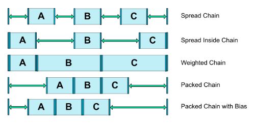

<!-- TOC -->

- [约束布局](#%e7%ba%a6%e6%9d%9f%e5%b8%83%e5%b1%80)

<!-- /TOC -->

## 约束布局

 

**相对**：如果相同 layout_constranctXX_toYYof   xx和yy相等表示对齐，不等表示该组件的xx边在其他组件的yy方向；

 

**外边距**：gone表示隐藏，visible设置为gone，表示为隐藏；有上下左右，水平左右，上下文本线；

除了普通外边距外，还有gonemargin，gonemargin需要配合layoutmargin一起使用，如果作为基准的那个组件消失隐藏了，那么将用gonemargin替换margin。

gonemargin在使用的时候，如果一个组件gone了，那么它的margin无效，宽高无效，会被视为一个点，因此，在设置layout_gonemarginXX的时候要计算好；

  

**居中定位和偏向**：相对的方式相当于力，如果左右都对齐，那么都有一个力去拉两边，则居中；

偏向bias：相当于是个比例，0到1  ，可以设置一个比例；有两个值layout_constranst_horizontal_bias 水平和垂直；

  

**尺寸约束**：组件的wrap_content使用的时候，可以设置最小最大的宽高。

具体尺寸，wrap_content，0dp；；；；0dp的宽高是跟着他的约束者走的

layout_constraint_demission_radio：设置组件的宽高比例

如果均为0dp在宽和高上，那么再使用layout_constraint_demission_radio 可以设置为"H,2:1" 则表示以约束的组件的高为基准，高宽比为2:1

  

**链条：**

在水平方向上，左端为头，在竖直方向上，顶部为头；

多个组件在水平或者竖直方向上，相互约束，和自己的左右两个组件约束，最后在父容器中设置头部的一个样式值后，可以稀疏各个组件，或者聚集各个组件。

layout_contrast_horizental_chainStyle 或者是垂直方向

 

​                             

 

**辅助布局**：guideline  起到锚点作用，是一个gone了的布局，貌似咋一条线上

  

**环形定位**，需要依赖约束布局的一个插件

圆心，半径，角度 三个条件决定

