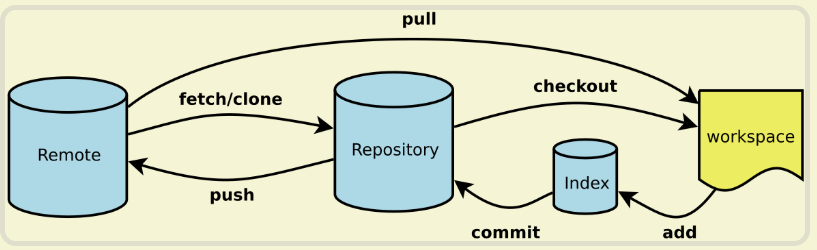

<br/>

<!-- TOC -->

- [git在线学习平台](#git%e5%9c%a8%e7%ba%bf%e5%ad%a6%e4%b9%a0%e5%b9%b3%e5%8f%b0)
- [删除克隆失败的文件](#%e5%88%a0%e9%99%a4%e5%85%8b%e9%9a%86%e5%a4%b1%e8%b4%a5%e7%9a%84%e6%96%87%e4%bb%b6)
- [常用命令](#%e5%b8%b8%e7%94%a8%e5%91%bd%e4%bb%a4)
- [配置文件](#%e9%85%8d%e7%bd%ae%e6%96%87%e4%bb%b6)
- [git remote](#git-remote)
- [git merge](#git-merge)
- [合并分支。](#%e5%90%88%e5%b9%b6%e5%88%86%e6%94%af)
- [git diff](#git-diff)
- [git reset](#git-reset)
- [git revert](#git-revert)
- [原理图](#%e5%8e%9f%e7%90%86%e5%9b%be)
- [ssh连接](#ssh%e8%bf%9e%e6%8e%a5)
- [Vim编辑](#vim%e7%bc%96%e8%be%91)

<!-- /TOC -->


## git在线学习平台

 https://try.github.io/

<br/>

## 删除克隆失败的文件

在bugbash中使用： `rm -rf ./xx_flutter`                       r:向下递归 f:强制删除

<br/>

## 常用命令

`git checkout .`  会取消所有本地的修改(相对于暂存区)，**相当于用暂存区的所有文件直接覆盖本地文件 **

`git clone <远程仓库的网址> -b <分支名称> <本地目录>`

<br/>

## 配置文件

```
1. 仓库级的配置文件：在仓库的 .git/.gitconfig，该配置文件只对所在的仓库有效。

2. 全局配置文件：Windows 系统在 C:\Users\<用户名>\.gitconfig。

3. 系统级的配置文件：在 Git 的安装目录下的 etc 文件夹中的 gitconfig。
```

<br/>

> \# 查看配置信息
>
> \# --local：仓库级，--global：全局级，--system：系统级
>
> $ git config <--local | --global | --system> -l

 <br/>

> \# 查看当前生效的配置信息
>
> $ git config -l

 <br/>

> \# 编辑配置文件
>
> \# --local：仓库级，--global：全局级，--system：系统级
>
> $ git config <--local | --global | --system> -e

 <br/>

> \# 添加配置项
>
> \# --local：仓库级，--global：全局级，--system：系统级
>
> $ git config <--local | --global | --system> --add <name> <value>

 <br/>

> \# 获取配置项
>
> $ git config <--local | --global | --system> --get <name>

 <br/>

> \# 删除配置项
>
> $ git config <--local | --global | --system> --unset <name>

 <br/>

> \# 配置提交记录中的用户信息
>
> $ git config --global user.name <用户名>
>
> $ git config --global user.email <邮箱地址>

 <br/>

> \# 更改Git缓存区的大小
>
> \# 如果提交的内容较大，默认缓存较小，提交会失败
>
> \# 缓存大小单位：B，例如：524288000（500MB）
>
> $ git config --global http.postBuffer <缓存大小>

 <br/>

> \# 调用 git status/git diff 命令时以高亮或彩色方式显示改动状态
>
> $ git config --global color.ui true

 <br/>

> \# 配置可以缓存密码，默认缓存时间15分钟
>
> $ git config --global credential.helper cache

 <br/>

> \# 配置密码的缓存时间
>
> \# 缓存时间单位：秒
>
> $ git config --global credential.helper 'cache --timeout=<缓存时间>'

 <br/>

> \# 配置长期存储密码
>
> $ git config --global credential.helper store

 <br/>

 

 <br/>

## git remote

操作远程库。

 <br/>

> \# 列出已经存在的远程仓库
>
> $ git remote

 <br/>

> \# 列出远程仓库的详细信息，在别名后面列出URL地址
>
> $ git remote -v
>
> $ git remote --verbose

 <br/>

> \# 添加远程仓库
>
> $ git remote add <远程仓库的别名> <远程仓库的URL地址>

 <br/>

> \# 修改远程仓库的别名
>
> $ git remote rename <原远程仓库的别名> <新的别名>

 <br/>

> \# 删除指定名称的远程仓库
>
> $ git remote remove <远程仓库的别名>

 <br/>

> \# 修改远程仓库的 URL 地址
>
> $ git remote set-url <远程仓库的别名> <新的远程仓库URL地址>

<br/>

## git merge

## 合并分支。

> \# 把指定的分支合并到当前所在的分支下
>
> $ git merge <分支名称>

<br/>

## git diff

比较版本之间的差异。

> \# 比较当前文件和暂存区中文件的差异，显示没有暂存起来的更改
>  $ git diff
>
> \# 比较暂存区中的文件和上次提交时的差异
>  $ git diff --cached
>  $ git diff --staged
>
> \# 比较当前文件和上次提交时的差异
>  $ git diff HEAD
>
> \# 查看从指定的版本之后改动的内容
>  $ git diff <commit ID>
>
> \# 比较两个分支之间的差异
>  $ git diff <分支名称> <分支名称>
>
> \# 查看两个分支分开后各自的改动内容
>  $ git diff <分支名称>...<分支名称>

<br/>

## git reset

修改的是head指针到前面的节点，而后面的节点就会消失；

还原提交记录。

 <br/>

> **#** **重置暂存区，但文件不受影响**
>
> \# 相当于将用 "git add" 命令更新到暂存区的内容撤出暂存区，可以指定文件
>
> \# 没有指定 commit ID 则默认为当前 HEAD
>
> $ git reset [<文件路径>]
>
> $ git reset --mixed [<文件路径>]       
>
>  <br/>
>
> \# 将 HEAD 的指向改变，**撤销到指定的提交记录**，文件未修改
>
> $ git reset <commit ID>           
>
> $ git reset --mixed <commit ID>
>
>  <br/>
>
> \# 将 HEAD 的指向改变，撤销到指定的提交记录，文件未修改
>
> \# 相当于调用 "git reset --mixed" 命令后又做了一次 "git add"
>
> $ git reset --soft <commit ID>
>
>  <br/>
>
> \# **将** **HEAD 的指向改变，撤销到指定的提交记录，文件也修改了**
>
> $ git reset --hard <commit ID>

 <br/>

参数：

> --mixed 
>
> 意思是：不删除工作空间改动代码，撤销commit，并且撤销`git add .`操作
>
> 这个为默认参数,git reset --mixed HEAD^ 和 git reset HEAD^ 效果是一样的。
>
>  <br/>
>
> --soft  
>
> 不删除工作空间改动代码，撤销commit，不撤销`git add .`
>
>  <br/>
>
> --hard
>
> 删除工作空间改动代码，撤销commit，撤销git add . 
>
> <br/>
>
> 注意完成这个操作后，就恢复到了上一次的commit状态。

<br/>

## git revert

> 生成一个新的提交来撤销某次提交，此次提交之前的所有提交都会被保留。看做本地和一个动态仓库的撤销；
>
> \# 生成一个新的提交来撤销某次提交
>
> $ git revert <commit ID>

<br/>

## 原理图



<br/>

<br/>

## ssh连接

```shell

ssh-keygen -t rsa -f ~/.ssh/id_rsa_pri -C "tiakoe@gitlab.com"
git config user.user "tiakoe"
git config user.email "1457xxx@qq.com"
 
Host gitlab_pri
HostName gitlab.com
PreferredAuthentications publickey
User tiakoe
IdentityFile ~/.ssh/id_rsa_pri

ssh -T git@gitlab_pri

git clone git@gitlab_pri:tiakoe/android-project.git

 
```

<br/>

<br/>

## Vim编辑

```
文档操作
:w —— 保存修改

:wq —— 保存并退出

:q[uit] —— 退出当前窗口


插入文本
I —— 在当前行第一个非空字符前插入
gI —— 在当前行第一列插入
a —— 在光标后插入
A —— 在当前行最后插入
o —— 在下面新建一行插入
O —— 在上面新建一行插入
```


