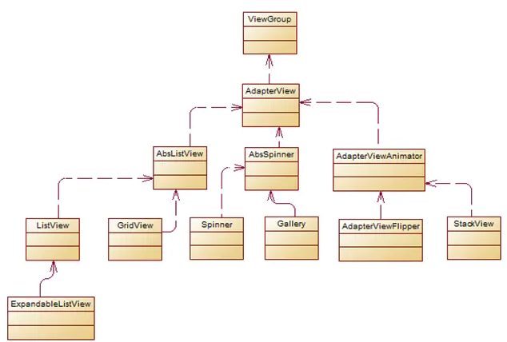
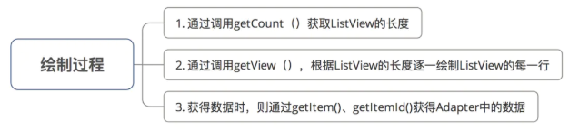

[TOC]

<br/>

## 列表视图组件类关系图




[img]: https://www.jianshu.com/p/4e8e4fd13cf7

<br/>

# 常用适配器介绍

<br/>

### ArrayAdapter

**定义**
简单、易用的Adapter，用于将数组绑定为列表项的数据源，支持泛型操作

<br/>

### SimpleAdapter

- **定义**：功能强大的Adapter，用于将XML中控件绑定作为列表项的数据源
- **特点**：可对每个列表项进行定制（自定义布局），能满足大多数开发的需求场景，灵活性较大

<br/>

### BaseAdapter

**定义**
 可自定义ListView，通用用于被扩展。扩展BaseAdapter可以对各个列表项进行最大程度的定制

**使用步骤：**

1. 定义主xml布局
2. 根据需要定义ListView每行所实现的xml布局
3. 定义一个Adapter类继承BaseAdapter，重写里面的方法。
4. 定义一个HashMap构成的列表，将数据以键值对的方式存放在里面。
5. 构造Adapter对象，设置适配器。
6. 将LsitView绑定到Adapter上。

**先定义一个Adapter类继承BaseAdapter，并重写里面的方法**

> 使用BaseAdapter必须写一个类继承它，同时BaseAdapter是一个抽象类，继承它必须实现它的方法。

<br/>

**这里主要讲一下BaseAdapter里必须要重写的4个方法**

- BaseAdapter的灵活性就在于它要重写很多方法，其中最重要的即为getView()方法。
- 我们结合上述重写的4个方法了解**ListView的绘制过程：**

<br/>

 

<br/>

```java
/**
  * 重写方式1：直接返回了指定索引对应的数据项的视图
  */
    @Override
    public View getView(int position, View convertView, ViewGroup parent) {
        View item = mInflater.inflate(R.layout.item,null);
        ImageView img = (ImageView)item.findViewById(R.id.ItemImage);
        TextView title = (TextView)item.findViewById(R.id.ItemTitle);
        TextView test = (TextView)item.findViewById(R.id.ItemText);
        Button btn = (Button) item.findViewById(R.id.ItemBottom);
        img.setImageResource((Integer) listItem.get(position).get("ItemImage"));
        title.setText((String) listItem.get(position).get("ItemTitle"));
        test.setText((String) listItem.get(position).get("ItemText"));

        return item;
    }
    // 缺点：
    // 每次调用getView()时，都要重新通过 findViewById（） 寻找View组件 & 重新绘制View
    // 当列表项数据量很大时会严重影响性能，即体现为下拉很慢、卡

/**
  * 重写方式2：使用convertView作为View缓存（优化）
  * 具体原理：
  *       // a. 将 convertView作为getView（）的输入参数 & 返回参数，从而形成反馈
  *       // b. 形成了Adapter的itemView重用机制，减少了重绘View的次数
  */
     @Override
    public View getView(int position, View convertView, ViewGroup parent) {

        // 检测有无可重用的View，若无就重新绘制
        if(convertView == null)
        {
            convertView = mInflater.inflate(R.layout.item, null);
        }
        ImageView img = (ImageView)convertView.findViewById(R.id.ItemImage);
        TextView title = (TextView)convertView.findViewById(R.id.ItemTitle);
        TextView test = (TextView)convertView.findViewById(R.id.ItemText);
        Button btn = (Button) convertView.findViewById(R.id.ItemBottom);
        img.setImageResource((Integer) listItem.get(position).get("ItemImage"));
        title.setText((String) listItem.get(position).get("ItemTitle"));
        test.setText((String) listItem.get(position).get("ItemText"));

        return convertView;
        // 最终返回convertView形成反馈
    }

    // 优点：减少了重绘View的次数
    // 缺点：但是每次都要通过 findViewById（） 寻找View组件

/**
  * 重写方式3：在方式2的基础上，使用ViewHolder实现更加具体的缓存：View组件缓存
  * 具体原理：
  *       // a. 将 convertView作为getView（）的输入参数 & 返回参数，从而形成反馈
  *       // b. 形成了Adapter的itemView重用机制，减少了重绘View的次数
  */
    static class ViewHolder

        {
            public ImageView img;
            public TextView title;
            public TextView text;
            public Button btn;
        }

    @Override
        public View getView(int position, View convertView, ViewGroup parent) {
            ViewHolder holder ;
            if(convertView == null)
            {
                holder = new ViewHolder();
                convertView = mInflater.inflate(R.layout.item, null);
                holder.img = (ImageView)convertView.findViewById(R.id.ItemImage);
                holder.title = (TextView)convertView.findViewById(R.id.ItemTitle);
                holder.text = (TextView)convertView.findViewById(R.id.ItemText);
                holder.btn = (Button) convertView.findViewById(R.id.ItemBottom);
                convertView.setTag(holder);
            }
            else {
                holder = (ViewHolder)convertView.getTag();

            }
            holder.img.setImageResource((Integer) listItem.get(position).get("ItemImage"));
            holder.title.setText((String) listItem.get(position).get("ItemTitle"));
            holder.text.setText((String) listItem.get(position).get("ItemText"));

            return convertView;
        }
  // 优点：重用View时就不用通过 findViewById（）重新 寻找View组件，同时也减少了重绘View的次数，是ListView使用的最优化方案
```

<br/>


<br/>

【参考】

1. https://www.jianshu.com/p/4e8e4fd13cf7


