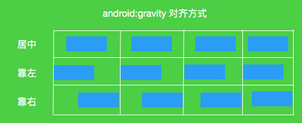
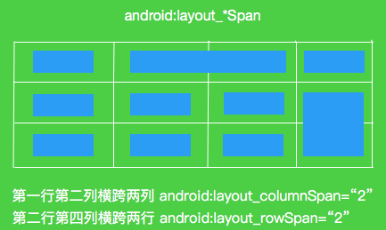

<!-- TOC -->

- [android.view.View XML 属性](#androidviewview-xml-%e5%b1%9e%e6%80%a7)
- [ViewGroup.LayoutParams 所支持的两个 xml 属性](#viewgrouplayoutparams-%e6%89%80%e6%94%af%e6%8c%81%e7%9a%84%e4%b8%a4%e4%b8%aa-xml-%e5%b1%9e%e6%80%a7)
- [LinearLayout 几个重要的 XML 属性](#linearlayout-%e5%87%a0%e4%b8%aa%e9%87%8d%e8%a6%81%e7%9a%84-xml-%e5%b1%9e%e6%80%a7)
- [LinearLayout.LayoutParams XML 属性](#linearlayoutlayoutparams-xml-%e5%b1%9e%e6%80%a7)
- [divider (分割线)](#divider-%e5%88%86%e5%89%b2%e7%ba%bf)
- [LinearLayout 线性布局中跟分隔线有关的属性有](#linearlayout-%e7%ba%bf%e6%80%a7%e5%b8%83%e5%b1%80%e4%b8%ad%e8%b7%9f%e5%88%86%e9%9a%94%e7%ba%bf%e6%9c%89%e5%85%b3%e7%9a%84%e5%b1%9e%e6%80%a7%e6%9c%89)
- [相对布局 (RelativeLayout) 有很多属性，归于以下几类](#%e7%9b%b8%e5%af%b9%e5%b8%83%e5%b1%80-relativelayout-%e6%9c%89%e5%be%88%e5%a4%9a%e5%b1%9e%e6%80%a7%e5%bd%92%e4%ba%8e%e4%bb%a5%e4%b8%8b%e5%87%a0%e7%b1%bb)
- [根据父容器定位属性](#%e6%a0%b9%e6%8d%ae%e7%88%b6%e5%ae%b9%e5%99%a8%e5%ae%9a%e4%bd%8d%e5%b1%9e%e6%80%a7)
- [根据兄弟组件定位属性](#%e6%a0%b9%e6%8d%ae%e5%85%84%e5%bc%9f%e7%bb%84%e4%bb%b6%e5%ae%9a%e4%bd%8d%e5%b1%9e%e6%80%a7)
- [设置外边距(偏移)属性](#%e8%ae%be%e7%bd%ae%e5%a4%96%e8%be%b9%e8%b7%9d%e5%81%8f%e7%a7%bb%e5%b1%9e%e6%80%a7)
- [设置内边距(填充)属性](#%e8%ae%be%e7%bd%ae%e5%86%85%e8%be%b9%e8%b7%9d%e5%a1%ab%e5%85%85%e5%b1%9e%e6%80%a7)
- [TableLayout 的主要属性](#tablelayout-%e7%9a%84%e4%b8%bb%e8%a6%81%e5%b1%9e%e6%80%a7)
- [TableRow 子控件的主要属性](#tablerow-%e5%ad%90%e6%8e%a7%e4%bb%b6%e7%9a%84%e4%b8%bb%e8%a6%81%e5%b1%9e%e6%80%a7)
- [FrameLayout 属性](#framelayout-%e5%b1%9e%e6%80%a7)
- [GridLayout 属性](#gridlayout-%e5%b1%9e%e6%80%a7)

<!-- /TOC -->

 

  

## android.view.View XML 属性

XML 属性    说明

android:alpha    设置该组件的透明度

android:background    设置该组件的背景颜色

android:clickable    设置该组件是否可以激发单击事件

android:contentDescription    设置该组件的主要描述信息

android:drawingCasheQuanlity    设置该组件所使用的绘制缓存质量

android:fadeScrollbars    设置该组件不使用滚动条时，是否淡出显示滚动条

android:fadingEdge    设置滚动该组件时边界是否使用淡出效果

android:fadingEdgeLength    设置淡出边界长度

android:focusable    设置该组件是否可以得到焦点

android:focusableInTouchMode    设置该组件在触摸模式下是否可以得到焦点

android:id    设置该组件ViewById来获取它

android:isScrollContainer    设置该组件是否可以作为可滚动容器使用

android:keepScreenOn    设置该组件是否会强制手机屏幕一直打开

android:longClickable    设置该组件是否可以响应长单击事件

android:minHeight    设置该组件的最小高度

android:minWidth    设置该组件的最小宽度

android:nextFocusDown    设置焦点在该组件上，且按向下键时获得焦点的组件id

android:nextFocusRight    设置焦点在该组件上，且按向右键时获得焦点的组件id

android:nextFocusLeft    设置焦点在该组件上，且按向左键时获得焦点的组件id

android:nextFocusUp    设置焦点在该组件上，且按向上键时获得焦点的组件id

android:onClick    为该组件的单击事件绑定监听器

android:padding    在组件的四边设置填充区域

android:paddingLeft    在组件的左边设置填充区域

android:paddingRight    在组件的右边设置填充区域

android:paddingBottom    在组件的底边设置填充区域

android:paddingTop    在组件的顶边设置填充区域

android:rotation    设置该组件的旋转角度

android:rotationX    设置该组件绕X轴旋转的角度

android:rotationY    设置该组件绕Y轴旋转的角度

android:saveEnabled    设置为false，当该组件被冻结时不会保存其状态

android:scaleX    设置该组件水平方向的缩放比

android:scaleY    设置该组件垂直方向的缩放比

android:scrollX    设置该组件初始化后的水平滚动条偏移

android:scrollY    设置该组件初始化后垂直滚动条偏移

android:scrollbarAlwaysDrawHorizontalTrack    设置该组件是否显示水平滚动条的轨迹

android:scrollbarAlwaysDrawVerticalTrack    设置该组件是否显示垂直滚动条的轨迹

android:scrollbarDefaultDelayBeforeFade    设置滚动条在淡出隐藏之前延迟多少毫秒

android:scrollbarFadeDuration    设置滚动条淡出隐藏需要多少秒

android:scrollbarSize    设置垂直滚动条的宽度和水平滚动条的高度

android:scrollbarStyle    设置滚动条的风格和位置：insideOverlay

android:scrollThumbHorizontal    设置该组件水平滚动滑块对对应的Drawable对象

android:scrollThumbVertical    设置该组件垂直滚动滑块对对应的Drawable对象

android:scrollTrackbHorizontal    设置该组件水平滚动轨道对对应的Drawable对象

android:scrollTrackbVertical    设置该组件垂直滚动轨道对对应的Drawable对象

android:scrollbar    设置该组件滚动时显示几个滚动条：none horizontal，vertical

android:soundEffectsEnabled    设置该组件被单击时是否使用音效

android:tag    为组件设置一个字符串tag值，可以通过view的getTag 获取字符串，或通过findViewByTag查找该组件

android:transformPivotX    设置该组件旋转时旋转中心的X坐标

android:transformPivotY    设置该组件旋转时旋转中心的Y坐标

android:translationX    设置该组件在x方向上的位移

android:translationY    设置该组件在Y方向上的位移

android:visibility    设置该组件是否可见

  

  

## ViewGroup.LayoutParams 所支持的两个 xml 属性

  

xml 属性    说明

android:layout_height    指定该子组件的布局高度，值可以是

fill_parent

match_parent

wrap_parent

android:layout_width    指定该子组件的布局宽度，值可以是

fill_parent

match_parent

wrap_parent

   

单位    说明

dp    device independent pixels(设备独立像素)

不同设备有不同的显示效果,这个和设备硬件有关，一般我们为了支持 WVGA、HVGA 和 QVGA 推荐使用这个，不依赖像素

px    pixels(像素). 不同设备显示效果相同，一般 HVGA 代表 320x480 像素，这个用的比较多

pt    point，是一个标准的长度单位，1pt＝1/72 英寸，用于印刷业，非常简单易用

sp    scaled pixels(放大像素). 主要用于字体显示

  

## LinearLayout 几个重要的 XML 属性

xml 属性    说明

android:id    为组件设置一个资源 id，然后在 Java 中可以通过 findViewById(id) 找到该组件

android:background    为组件设置一个背景图片或者背景色

android:layout_width    布局的宽度，通常不直接写数字值，而是使用

wrap_content 组件实际大小

fill_parent/match_parent 填满父容器

android:layout_height    同 layout:layout_width

android:baselineAligned    该属性为 false，将会阻止布局管理器与它的子元素基线对其

android:divider    设置垂直布局时，两个按钮之间的分隔条

android:gravity    设置布局管理器内组件的对齐方式，值可以是

top/button/left/right/center_vertical/fill_vertical...

android:measureWithLargestChild    当属性设置为true时，所有带权重的子元素都会具有最大元素的最小尺寸

android:orientation    设置布局管理器内组件的排列方式，值可以是

vertical (默认)

horizontal

  

## LinearLayout.LayoutParams XML 属性

xml 属性    说明

android:layout_gravity    指定该布局管理器内子组件布局方式

android:layout_weight    指定该子元素在 linearLayout 中所占的权重

  

android:layout_weight

android:layout_weight 是 LinearLayout 最重要的属性，可以说掌握了该属性就掌握了 LinearLayout

android:layout_weight 是按比例来划分布局控件，比如三七开，五五开等

   

## divider (分割线)

xml 属性    说明

android:divider    属性用于设置 LinearLayout 的分割线图片

android:showDividers    设置分割线所在的位置，有四个可选值

none/middle/begin/end

android:dividerPadding    设置分割线的内边距

  

## LinearLayout 线性布局中跟分隔线有关的属性有

xml 属性    说明

android:divider    属性用于设置 LinearLayout 的分割线图片

android:showDividers    设置分割线所在的位置，有四个可选值

none 无

middle 两个组件之间

begin 开始位置

end 结束位置

android:dividerPadding    设置分割线的内边距

  

## 相对布局 (RelativeLayout) 有很多属性，归于以下几类

   

XML 属性    说明

android:gravity    设置容器内组件的排序方式

android:ignoreGravity    如果设置改属性为 true，将忽略 android:gravity

  

## 根据父容器定位属性

  

XML 属性    说明

android:layout_alignParentLeft    左对齐父容器

android:layout_alignParentRight    右对齐父容器

android:layout_alignParentTop    顶部对齐父容器

android:layout_alignParentBottom    底部对齐父容器

android:layout_centerHorizontal    在父容器中水平居中

android:layout_centerVertical    在父容器中垂直居中

android:layout_centerInParent    在父容器的居中位置

  

## 根据兄弟组件定位属性

  

XML 属性    说明

android:layout_toLeftOf    紧贴参考组件的左边

android:layout_toRightOf    紧贴参考组件的右边

android:layout_above    紧贴参考组件的上方

android:layout_below    紧贴参考组件的下方

android:layout_alignTop    对齐参考组件的上边界

android:layout_alignBottom    对齐参考组件的下边界

android:layout_alignLeft    对齐参考组件的左边界

android:layout_alignRight    对齐参考组件的右边界

  

## 设置外边距(偏移)属性

  

XML 属性    说明

android:layout_maring    设置组件上下左右的偏移量

android:layout_marginLeft    设置组件左边的偏移量

android:layout_marginRight    设置组件右边的偏移量

android:layout_marginTop    设置组件上边的偏移量

android:layout_marginBottom    设置组件下边的偏移量

  

## 设置内边距(填充)属性

  

XML 属性    说明

android:padding    设置组件上下左右的填充

android:paddingLeft    设置组件左边的填充

android:paddingRight    设置组件右边的填充

android:paddingTop    设置组件上边的填充

android:paddingBottom    设置组件下边的填充

  

## TableLayout 的主要属性

属性    说明

android:collapseColumns    设置需要 被隐藏 的列的序号

android:shrinkColumns    设置允许 被收缩 的列的列序号

android:stretchColumns    设置运行 被拉伸 的列的列序号

  

还有两个属性,分别就是跳过格子以及合并单元格

  

属性    说明

android:layout_column="2"    表示的就是 跳过 第二个,直接显示到第三个格子处,从1开始算的

android:layout_span="4"    表示 合并 4个单元格,也就说这个组件占4个单元格

  

## TableRow 子控件的主要属性

属性    说明

android:layout_column="1"    该控件显示在第1列

android:layout_span="2"    该控件占据2列

  

android: collapseColumns 隐藏列

然后修改最外层的 TableLayout 添加以下属性来隐藏第一与第三列

  

android:collapseColumns = "0,2"

android:stretchColumns 拉伸列

android:shrinkColumns 收缩列

  

## FrameLayout 属性

属性    说明

android:foreground    设置改帧布局容器的前景图像

android:foregroundGravity    设置前景图像显示的位置

前景图像:永远处于帧布局最上面,直接面对用户的图像,就是不会被覆盖的图片

  

## GridLayout 属性

设置排列方式

属性    说明

android:orientation    设置子组件的排列方式，值可以是

vertical 竖直，默认

horizontal 水平

android:gravity    设置子组件的排列方式，值可以是

center 居中

left 靠左

right 靠右

bottom 底部....

如果想要同时使用两种，可以用 left|bottom

 

设置几行几列

属性    说明

android:rowCount    设置网格布局有几行

android:columnCount    设置网格布局有几列

  

设置组件所在的行或列

注意： 行列从 0 开始计算，比如第一行是 0 ，第二行是 1

  

属性    说明

android:layout_row    设置组件位于第几行

android:layout_column    设置组件位于第几列

  

设置组件跨几行几列

属性    说明

android:layout_rowSpan    设置组件跨几行

android:layout_columnSpan    设置组件跨几列

 

 