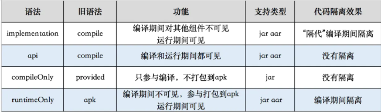

<!-- TOC -->

- [gradle下载](#gradle下载)
- [gradle.properties](#gradleproperties)
- [命令](#命令)
- [gradle3.0.0分析](#gradle300分析)

<!-- /TOC -->


<br/>

## gradle下载

https://services.gradle.org/distributions/
如果 gradle 初次构建缓慢，可以手动下载代理放到`${USER}/.gradle/wrapper/dists`下

<br/>

## gradle.properties

```properties
# 开启并行编译
org.gradle.parallel=true
# 开启守护进程
org.gradle.daemon=true
# 按需编译
org.gradle.configureondemand=true
# 设置编译jvm参数
org.gradle.jvmargs=-Xmx2048m -XX:MaxPermSize=512m -XX:+HeapDumpOnOutOfMemoryError -Dfile.encoding=UTF-8
# 设置代理
systemProp.http.proxyHost=127.0.0.1
systemProp.http.proxyPort=10384
systemProp.https.proxyHost=127.0.0.1
systemProp.https.proxyPort=10384
# 开启JNI编译支持过时API
android.useDeprecatedNdk=true
```

<br/>

## 命令

在window下可以直接运行 `gradlew` 

Linux 或者 mac 命令为 `gradle gradlew`  

```sh
# 查看任务
./gradlew tasks
# 查看所有任务 包括缓存任务等
./gradlew tasks --all
# 对某个module [moduleName] 的某个任务[TaskName] 运行
./gradlew :moduleName:taskName
```

<br/>

> 构建命令

```sh
# 查看构建版本
./gradlew -v
# 清除build文件夹
./gradlew clean
# 检查依赖并编译打包
./gradlew build
# 编译并安装debug包
./gradlew installDebug
# 编译并打印日志
./gradlew build --info
# 译并输出性能报告，性能报告一般在 构建工程根目录 build/reports/profile
./gradlew build --profile
# 调试模式构建并打印堆栈日志
./gradlew build --info --debug --stacktrace
# 强制更新最新依赖，清除构建并构建
./gradlew clean build --refresh-dependencies
```

<br/>

`build`命令会把 `debug、release`环境的包都打出来

<br/>

```sh
# 编译并打Debug包
./gradlew assembleDebug
# 这个是简写 assembleDebug
./gradlew aD
# 编译并打Release的包
./gradlew assembleRelease
# 这个是简写 assembleRelease
./gradlew aR
```

<br/>

```sh
# 编译并打Debug包
./gradlew assembleDebug
# 指定模块编译并打Debug包
./gradlew :<ModuleName>:assembleDebug
# 编译app module 并打Debug包
./gradlew install app:assembleDebug
# 编译并打Release的包
./gradlew assembleRelease
#  Release模式打包并安装
./gradlew installRelease
# 卸载Release模式包
./gradlew uninstallRelease
```

<br/>

<br/>

## gradle3.0.0分析

compile被废弃，分成了两个：implementation和api，其中api与之前的compile功能基本一致；

使用implementation添加的依赖不会再编译期间被其他组件引用到，但在运行期间是完全可见的。

> 组件A依赖lib1，既A implementation lib1
>
> 组件B依赖组件A，既B api A

在gradle3.0.0之前，B是完全可以引用到lib1里面的类的，但是现在B在编译期间就做不到了，只能在运行期可以。这种思想有点类似于“下属的下属不是你的下属”的思想。但是这种隔离在组件之间是不起作用的，在上面的例子中A的所有类对B还是完全可见的，也就是没有做任何隔离的。不过implementation的确是一种有效减少编译时间的方式，还是上面的例子，lib1发生了变化，现在只需要编译A就可以了，而在之前B有可能也使用到了lib1，所以需要同时编译B和A。按照官方建议，大部分情况下都应该使用implementation来进行添加依赖。

runtimeOnly可以支持aar，compileOnly只能支持jar



[参考]: https://juejin.im/post/59ffc0c651882512a860b1b4


