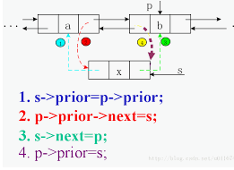
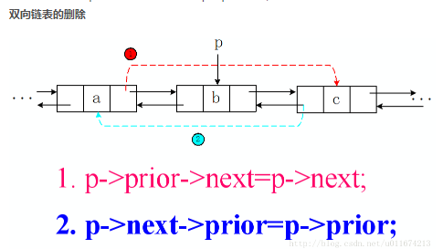

 

<!-- TOC -->

- [哈夫曼编码](#哈夫曼编码)
- [线性结构](#线性结构)
- [时间复杂度](#时间复杂度)
- [双链表插入](#双链表插入)
- [双链表删除](#双链表删除)
- [equal与hashcode](#equal与hashcode)

<!-- /TOC -->

 

### 哈夫曼编码

已知字符A、B、C、D的使用频率（权值）分别为22，7，9，27。对其进行HUFFMAN编码，各字符对应的编码为（ ）

A（11） B（100）C（101） D（0）

 

### 线性结构

- 广义表是非线性结构的，它也是线性表的一种推广
- 二叉树是树状结构
- 稀疏矩阵常用来存储图
- 串，如字符串，是线性结构

 

### 时间复杂度

对于一个含n个元素的无序数组，构建一个大顶堆（Max-Heap），该操作的时间复杂度是Θ(____)

初始化建堆时间复杂度是O(n),排序重建堆时间复杂度则为nlog(n)

 

例题：

下列各排序法中，最坏情况下的时间复杂度最低的是（ ）

堆排序

堆排序最坏情况时间下的时间复杂度为 O(nlog2n) ；希尔排序最坏情况时间下的时间复杂度为 O(n1.5) ；快速排序、冒泡排序最坏情况时间下的时间复杂度为 O(n2) 。

 

### 双链表插入

 

### 双链表删除

 

### equal与hashcode

equal()相等的两个对象他们的hashCode()肯定相等，也就是用equal()对比是绝对可靠的。

hashCode()相等的两个对象他们的equal()不一定相等，也就是hashCode()不是绝对可靠的。

