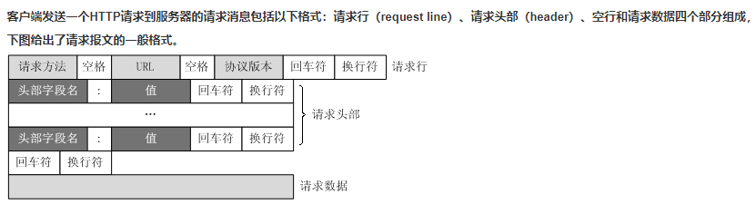

 

<!-- TOC -->

- [三次握手：](#三次握手)
- [四次挥手](#四次挥手)
- [TCP和UDP区别](#tcp和udp区别)
- [请求报文](#请求报文)
- [HTTP 请求报文头部](#http-请求报文头部)
- [HTTP 响应头](#http-响应头)
- [七层协议](#七层协议)

<!-- /TOC -->

 

在一个IP数据包到达目的地之前，可能发生很多的情况，以下哪个说法是正确的（）？

可能成为碎片，但是不会重组

 

以下哪些方法可以取到http请求中的cookie值（）?

request.getHeader

request.getCookies

 

### 三次握手：

第一次

第一次握手：建立连接时，客户端发送syn包（syn=j）到服务器，并进入SYN_SENT状态，等待服务器确认；SYN：同步序列编号（Synchronize Sequence Numbers）。

第二次

第二次握手：服务器收到syn包，必须确认客户的SYN（ack=j+1），同时自己也发送一个SYN包（seq=k），即SYN+ACK包，此时服务器进入SYN_RECV状态；

第三次

第三次握手：客户端收到服务器的SYN+ACK包，向服务器发送确认包ACK(ack=k+1），此包发送完毕，客户端和服务器进入ESTABLISHED（TCP连接成功）状态，完成三次握手。

 

ACK：确认序号有效 

RST：重置连接 

SYN：发起了一个新连接 

FIN：释放一个连接

 

### 四次挥手

由于**TCP连接是全双工的**，因此每个方向都必须单独进行关闭。这原则是当一方完成它的数据发送任务后就能发送一个FIN来终止这个方向的连接。收到一个     FIN只意味着这一方向上没有数据流动，一个TCP连接在收到一个FIN后仍能发送数据。首先进行关闭的一方将执行主动关闭，而另一方执行被动关闭。

（1） TCP客户端发送一个FIN，用来关闭客户到服务器的数据传送。

（2） 服务器收到这个FIN，它发回一个ACK，确认序号为收到的序号加1。和SYN一样，一个FIN将占用一个序号。

（3） 服务器关闭客户端的连接，发送一个FIN给客户端。

（4） 客户端发回ACK报文确认，并将确认序号设置为收到序号加1。

 

### TCP和UDP区别

UDP 是一个简单的传输层协议。和 TCP 相比，UDP 有下面几个显著特性：

1. **UDP 缺乏可靠性。**UDP 本身不提供确认，序列号，超时重传等机制。UDP 数据报可能在网络中被复制，被重新排序。即 UDP 不保证数据报会到达其最终目的地，也不保证各个数据报的先后顺序，也不保证每个数据报只到达一次

2. **UDP** **数据报是有长度的**。每个 UDP 数据报都有长度，如果一个数据报正确地到达目的地，那么该数据报的长度将随数据一起传递给接收方。而 TCP 是一个字节流协议，没有任何（协议上的）记录边界。

3. **UDP** **是无连接的**。UDP 客户和服务器之前不必存在长期的关系。UDP 发送数据报之前也不需要经过握手创建连接的过程。

4. **UDP** **支持多播和广播。**

 

TCP提供一种面向连接的、可靠的字节流服务

1. 在一个 TCP 连接中，仅有两方进行彼此通信。广播和多播不能用于 TCP

2. TCP 使用校验和，确认和重传机制来保证可靠传输

3. TCP 给数据分节进行排序，并使用累积确认保证数据的顺序不变和非重复

4. TCP 使用滑动窗口机制来实现流量控制，通过动态改变窗口的大小进行拥塞控制

 

### 请求报文

 

 

### HTTP 请求报文头部

User-Agent：产生请求的浏览器类型。

Accept：客户端可识别的响应内容类型列表;

Accept-Language：客户端可接受的自然语言;

Accept-Encoding：客户端可接受的编码压缩格式;

Accept-Charset：可接受的应答的字符集;

Host：请求的主机名，允许多个域名同处一个IP 地址，即虚拟主机;（必选）

Connection：连接方式(close 或 keep-alive);

Cookie：存储于客户端扩展字段，向同一域名的服务端发送属于该域的cookie;

请求包体：在POST方法中使用。

Referer：包含一个URL，用户从该URL代表的页面出发访问当前请求的页面。

If-Modified-Since：文档的最后改动时间

  

  

### HTTP 响应头

Allow 服务器支持哪些请求方法（如GET、POST等）。

Content-Encoding 文档的编码（Encode）方法。

Content-Length 表示内容长度。只有当浏览器使用持久HTTP连接时才需要这个数据。

Content-Type 表示后面的文档属于什么MIME类型。

Date 当前的GMT时间。你可以用setDateHeader来设置这个头以避免转换时间格式的麻烦。

Expires 应该在什么时候认为文档已经过期，从而不再缓存它。

Last-Modified 文档的最后改动时间。

Refresh 表示浏览器应该在多少时间之后刷新文档，以秒计。

Server 服务器名字。

Set-Cookie 设置和页面关联的Cookie。

ETag：被请求变量的实体值。ETag是一个可以与Web资源关联的记号（MD5值）。

Cache-Control：这个字段用于指定所有缓存机制在整个请求/响应链中必须服从的指令。

 

### 七层协议

