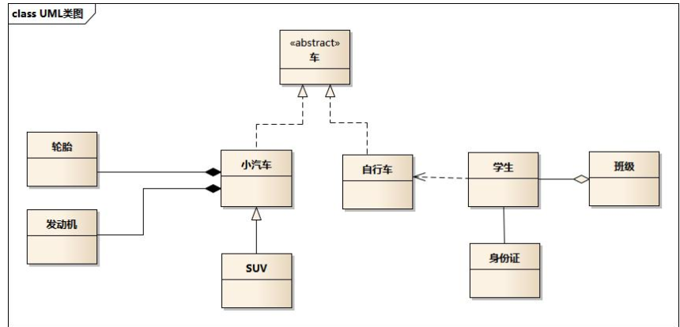
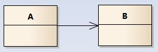

<!-- TOC -->

- [设计模式六大原则](#设计模式六大原则)
- [设计模式](#设计模式)
    - [根据目的划分：](#根据目的划分)
    - [根据作用范围来分](#根据作用范围来分)
- [23种设计模式的功能](#23种设计模式的功能)
- [UML](#uml)
    - [实现关系：](#实现关系)
    - [泛化关系：](#泛化关系)
    - [聚合关系：](#聚合关系)
    - [组合关系(composition)：](#组合关系composition)
    - [关联关系(association)：](#关联关系association)
    - [依赖关系(dependency)：](#依赖关系dependency)
- [关系代码表示](#关系代码表示)
- [MVC、MVP、MVVM](#mvcmvpmvvm)

<!-- /TOC -->

### 设计模式六大原则

单一职责原则：即一个类应该只负责一项职责

里氏替换原则：所有引用基类的地方必须能透明地使用其子类的对象

依赖倒转原则：高层模块不应该依赖低层模块，二者都应该依赖其抽象；抽象不应该依赖细节，细节应该依赖抽象

接口隔离原则：客户端不应该依赖它不需要的接口；一个类对另一个类的依赖应该建立在最小的接口上

迪米特法则：一个对象应该对其他对象保持最少的了解

开闭原则：对扩展开放，对修改关闭

### 设计模式

#### 根据目的划分：

1. **创建型模式**：用于描述“怎样创建对象”，它的主要特点是“将对象的创建与使用分离”。GoF     中提供了单例、原型、工厂方法、抽象工厂、建造者等 5 种创建型模式。
2. **结构型模式**：用于描述如何将类或对象按某种布局组成更大的结构，GoF 中提供了代理、适配器、桥接、装饰、外观、享元、组合等 7 种结构型模式。
3. **行为型模式**：用于描述类或对象之间怎样相互协作共同完成单个对象都无法单独完成的任务，以及怎样分配职责。GoF 中提供了模板方法、策略、命令、职责链、状态、观察者、中介者、迭代器、访问者、备忘录、解释器等 11 种行为型模式。

#### 根据作用范围来分

根据模式是主要用于**类上**还是主要用于**对象上**来分，这种方式可分为类模式和对象模式

 

1. 类模式：用于处理类与子类之间的关系，这些关系通过继承来建立，是静态的，在编译时刻便确定下来了。GoF中的工厂方法、（类）适配器、模板方法、解释器属于该模式。
2. 对象模式：用于处理对象之间的关系，这些关系可以通过组合或聚合来实现，在运行时刻是可以变化的，更具动态性。GoF 中除了以上 4 种，其他的都是对象模式。

### 23种设计模式的功能

1. **单例（Singleton）模式**：某个类只能生成一个实例，该类提供了一个全局访问点供外部获取该实例，其拓展是有限多例模式。
2. **原型（Prototype ）模式**：将一个对象作为原型，通过对其进行复制而克隆出多个和原型类似的新实例。
3. **工厂方法（ Factory     Method ）模式**：定义一个用于创建产品的接口，由子类决定生产什么产品。
4. **抽象工厂（ AbstractFactory  ）模式**：提供一个创建产品族的接口，其每个子类可以生产一系列相关的产品。
5. **建造者（ Builder ）模式**：将一个复杂对象分解成多个相对简单的部分，然后根据不同需要分别创建它们，最后构建成该复杂对象。
6. **代理（ Proxy ）模式**：为某对象提供一种代理以控制对该对象的访问。即客户端通过代理间接地访问该对象，从而限制、增强或修改该对象的一些特性。
7. **适配器（ Adapter ）模式**：将一个类的接口转换成客户希望的另外一个接口，使得原本由于接口不兼容而不能一起工作的那些类能一起工作。
8. **桥接（Bridge）模式**：将抽象与实现分离，使它们可以独立变化。它是用组合关系代替继承关系来实现，从而降低了抽象和实现这两个可变维度的耦合度。
9. **装饰（Decorator）模式**：动态的给对象增加一些职责，即增加其额外的功能。
10. **外观（Facade）模式**：为多个复杂的子系统提供一个一致的接口，使这些子系统更加容易被访问。
11. **享元（Flyweight）模式**：运用共享技术来有效地支持大量细粒度对象的复用。
12. **组合（Composite）模式**：将对象组合成树状层次结构，使用户对单个对象和组合对象具有一致的访问性。
13. **模板方法（TemplateMethod）模式**：定义一个操作中的算法骨架，而将算法的一些步骤延迟到子类中，使得子类可以不改变该算法结构的情况下重定义该算法的某些特定步骤。
14. **策略（Strategy）模式**：定义了一系列算法，并将每个算法封装起来，使它们可以相互替换，且算法的改变不会影响使用算法的客户。
15. **命令（Command）模式**：将一个请求封装为一个对象，使发出请求的责任和执行请求的责任分割开。
16. **职责链（Chain of     Responsibility）模式**：把请求从链中的一个对象传到下一个对象，直到请求被响应为止。通过这种方式去除对象之间的耦合。
17. **状态（State）模式**：允许一个对象在其内部状态发生改变时改变其行为能力。
18. **观察者（Observer）模式**：多个对象间存在一对多关系，当一个对象发生改变时，把这种改变通知给其他多个对象，从而影响其他对象的行为。
19. **中介者（Mediator）模式**：定义一个中介对象来简化原有对象之间的交互关系，降低系统中对象间的耦合度，使原有对象之间不必相互了解。
20. **迭代器（Iterator）模式**：提供一种方法来顺序访问聚合对象中的一系列数据，而不暴露聚合对象的内部表示。
21. **访问者（Visitor）模式**：在不改变集合元素的前提下，为一个集合中的每个元素提供多种访问方式，即每个元素有多个访问者对象访问。
22. **备忘录（Memento）模式**：在不破坏封装性的前提下，获取并保存一个对象的内部状态，以便以后恢复它。
23. **解释器（Interpreter）模式**：提供如何定义语言的文法，以及对语言句子的解释方法，即解释器。

### UML

[1]: https://www.bookstack.cn/	"书栈网"

- 车的类图结构为<>，表示车是一个抽象类；
- 它有两个继承类：小汽车和自行车；它们之间的关系为实现关系，使用带空心箭头的虚线表示；
- 小汽车为与SUV之间也是继承关系，它们之间的关系为泛化关系，使用带空心箭头的实线表示；
- 小汽车与发动机之间是组合关系，使用带实心箭头的实线表示；
- 学生与班级之间是聚合关系，使用带空心箭头的实线表示；
- 学生与身份证之间为关联关系，使用一根实线表示；
- 学生上学需要用到自行车，与自行车是一种依赖关系，使用带箭头的虚线表示；下面我们将介绍这六种关系；

类的继承结构表现在UML中为：**泛化(generalize)与实现(realize)：**

继承关系为 is-a的关系；两个对象之间如果可以用 is-a 来表示，就是继承关系：（..是..)

 

#### 实现关系：

表现为继承抽象

 

#### 泛化关系：

表现为继承非抽象类；

 

#### 聚合关系：

用于表示实体对象之间的关系，表示整体由部分**构成**的语义；

与组合关系不同的是，整体和部分不是强依赖的，即使整体不存在了，部分仍然存在；

**例如，部门撤销了，人员不会消失，他们依然存在；**

 

#### 组合关系(composition)：

组合关系是一种强依赖的特殊聚合关系，如果整体不存在了，则部分也不存在了；**例如，公司不存在了，部门也将不存在了；**

 

#### 关联关系(association)：

它描述不同类的对象之间的结构关系；它是一种静态关系，通常与运行状态无关，一般由**常识等因素决定**的；它一般用来定义对象之间静态的、天然的结构；所以，关联关系是一种“强关联”的关系；

**比如，乘车人和车票之间就是一种关联关系；学生和学校就是一种关联关系；**

**关联关系默认不强调方向，表示对象间相互知道；如果特别强调方向，如下图，表示A知道B，但B不知道A；** **注：在最终代码中，关联对象通常是以成员变量的形式实现的；**

 

#### 依赖关系(dependency)：

他描述一个对象在运行期间会用到另一个对象的关系；

与关联关系不同的是，它是一种临时性的关系，通常在运行期间产生，并且随着运行时的变化；依赖关系也可能发生变化；

依赖也有方向，双向依赖是一种非常糟糕的结构，我们总是应该保持单向依赖，**杜绝双向依赖的产生；**

注：在最终代码中，依赖关系体现为类构造方法及类方法的传入参数，箭头的指向为调用关系；依赖关系除了临时知道对方外，还是“使用”对方的方法和属性；

### 关系代码表示

实现：继承

泛化：继承

聚合：类中传入一个对象；装饰者模式，存在字段，

组合：存在实体的集合；//组合关系中的成员变量一般会在构造方法中赋值

依赖：//类A当中使用了类B，其中类B是作为类A的方法参数、方法中的局部变量、或者静态方法调用。

关联：单向关联表现为：类A当中使用了类B，其中类B是作为类A的成员变量。双向关联表现为：类A当中使用了类B作为成员变量；同时类B中也使用了类A作为成员变量。

### MVC、MVP、MVVM

mvc：模型，视图，控制

mvp：模型，视图，Presenter（主持人）  view<=>**presenter**<=>model

mvvm:  model-view-viewModel，基本上与 MVP模式完全一致。

唯一的区别是，它采用双向绑定（data-binding）：View的变动，自动反映在 ViewModel，反之亦然。Angular 和 Ember 都采用这种模式。

